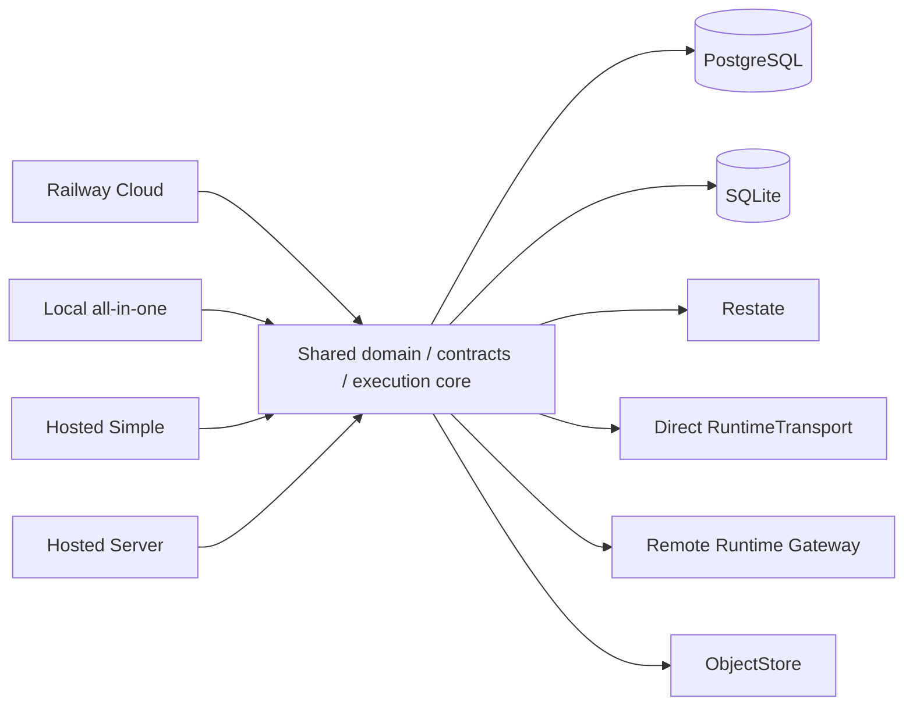

# Control Plane architecture, contracts, persistence, and production wiring audit

Generated from [control-plane-architecture.v1.json](./control-plane-architecture.v1.json) for candidate `6c922d487c3c2e70a047c11c55a1cb4ddbabad26`. Do not edit this report directly; run `bun run architecture:write`.

## Audit summary

- 45 workspace packages and applications.
- 52 public SDK operations.
- 4 deployment profiles.
- 12 persistence parity boundaries.
- 41 verified, 38 partially verified, 0 not implemented, and 0 superseded classified paths.

## Package dependency diagram

```mermaid
flowchart LR
  P0["acp-adapter"]
  P1["bootstrap"]
  P2["config"]
  P3["context"]
  P4["contracts"]
  P5["control-api"]
  P6["cortana-context-adapter"]
  P7["credential-vault"]
  P8["database"]
  P9["deployment"]
  P10["domain"]
  P11["events"]
  P12["execution-plan"]
  P13["hosted-control-plane"]
  P14["langgraph-adapter"]
  P15["local-control-plane"]
  P16["managed-pi-adapter"]
  P17["memory-writeback"]
  P18["model-gateway"]
  P19["object-store"]
  P20["orchestration"]
  P21["pi-cloudflare-host"]
  P22["pi-durable-adapter"]
  P23["policy"]
  P24["production-readiness"]
  P25["profile-adapters"]
  P26["profile-portability"]
  P27["remote-control-relay"]
  P28["restate-runtime"]
  P29["runtime-gateway"]
  P30["runtime-gateway-protocol"]
  P31["runtime-sdk"]
  P32["runtime-worker"]
  P33["sandbox"]
  P34["sdk"]
  P35["secrets"]
  P36["sqlite-persistence"]
  P37["telemetry"]
  P38["testing"]
  P39["tool-execution"]
  P40["tool-gateway"]
  P41["tool-sdk"]
  P42["usage-ledger"]
  P43["workflow-runtime"]
  P44["workflow-worker"]
  P0 --> P9
  P0 --> P10
  P0 --> P30
  P0 --> P31
  P1 --> P2
  P1 --> P37
  P2 --> P4
  P2 --> P37
  P3 --> P4
  P3 --> P10
  P5 --> P1
  P5 --> P2
  P5 --> P3
  P5 --> P4
  P5 --> P7
  P5 --> P8
  P5 --> P9
  P5 --> P10
  P5 --> P12
  P5 --> P17
  P5 --> P18
  P5 --> P20
  P5 --> P22
  P5 --> P31
  P5 --> P37
  P5 --> P39
  P5 --> P42
  P6 --> P3
  P6 --> P4
  P6 --> P30
  P7 --> P4
  P7 --> P23
  P8 --> P2
  P8 --> P3
  P8 --> P4
  P8 --> P7
  P8 --> P10
  P8 --> P11
  P8 --> P12
  P8 --> P17
  P8 --> P18
  P8 --> P20
  P8 --> P24
  P8 --> P30
  P8 --> P31
  P8 --> P39
  P8 --> P41
  P8 --> P42
  P10 --> P4
  P11 --> P4
  P11 --> P10
  P11 --> P37
  P12 --> P3
  P12 --> P4
  P12 --> P10
  P12 --> P31
  P13 --> P1
  P13 --> P2
  P13 --> P3
  P13 --> P4
  P13 --> P5
  P13 --> P8
  P13 --> P9
  P13 --> P10
  P13 --> P12
  P13 --> P14
  P13 --> P17
  P13 --> P19
  P13 --> P20
  P13 --> P27
  P13 --> P28
  P13 --> P35
  P13 --> P37
  P13 --> P39
  P13 --> P41
  P13 --> P42
  P13 --> P43
  P13 --> P44
  P14 --> P4
  P14 --> P9
  P14 --> P10
  P14 --> P11
  P14 --> P12
  P14 --> P20
  P14 --> P37
  P15 --> P0
  P15 --> P1
  P15 --> P2
  P15 --> P3
  P15 --> P4
  P15 --> P5
  P15 --> P9
  P15 --> P10
  P15 --> P11
  P15 --> P12
  P15 --> P14
  P15 --> P16
  P15 --> P17
  P15 --> P18
  P15 --> P19
  P15 --> P20
  P15 --> P27
  P15 --> P28
  P15 --> P31
  P15 --> P35
  P15 --> P36
  P15 --> P37
  P15 --> P39
  P15 --> P41
  P15 --> P42
  P15 --> P43
  P15 --> P44
  P16 --> P9
  P16 --> P10
  P16 --> P30
  P16 --> P31
  P17 --> P4
  P17 --> P10
  P18 --> P4
  P18 --> P7
  P18 --> P9
  P18 --> P10
  P18 --> P23
  P18 --> P42
  P19 --> P4
  P19 --> P9
  P19 --> P41
  P20 --> P3
  P20 --> P4
  P20 --> P10
  P20 --> P12
  P20 --> P31
  P20 --> P41
  P21 --> P31
  P22 --> P4
  P22 --> P10
  P22 --> P12
  P22 --> P18
  P22 --> P20
  P22 --> P31
  P22 --> P39
  P22 --> P41
  P22 --> P42
  P23 --> P4
  P24 --> P4
  P25 --> P9
  P25 --> P20
  P25 --> P31
  P26 --> P3
  P26 --> P7
  P26 --> P8
  P26 --> P9
  P26 --> P10
  P26 --> P12
  P26 --> P24
  P26 --> P36
  P27 --> P4
  P27 --> P9
  P28 --> P9
  P29 --> P1
  P29 --> P2
  P29 --> P3
  P29 --> P4
  P29 --> P6
  P29 --> P8
  P29 --> P9
  P29 --> P10
  P29 --> P11
  P29 --> P30
  P29 --> P31
  P29 --> P36
  P29 --> P37
  P30 --> P31
  P31 --> P4
  P32 --> P1
  P32 --> P2
  P32 --> P6
  P32 --> P8
  P32 --> P10
  P32 --> P16
  P32 --> P19
  P32 --> P30
  P32 --> P31
  P32 --> P36
  P33 --> P4
  P34 --> P4
  P34 --> P31
  P35 --> P9
  P36 --> P3
  P36 --> P4
  P36 --> P7
  P36 --> P9
  P36 --> P10
  P36 --> P11
  P36 --> P12
  P36 --> P17
  P36 --> P20
  P36 --> P24
  P36 --> P31
  P36 --> P39
  P36 --> P41
  P36 --> P42
  P38 --> P2
  P38 --> P8
  P39 --> P2
  P39 --> P4
  P39 --> P10
  P39 --> P23
  P39 --> P41
  P40 --> P1
  P40 --> P39
  P41 --> P4
  P42 --> P4
  P43 --> P2
  P43 --> P4
  P43 --> P9
  P43 --> P10
  P43 --> P20
  P43 --> P31
  P44 --> P1
  P44 --> P2
  P44 --> P3
  P44 --> P4
  P44 --> P8
  P44 --> P10
  P44 --> P11
  P44 --> P12
  P44 --> P16
  P44 --> P19
  P44 --> P20
  P44 --> P23
  P44 --> P30
  P44 --> P31
  P44 --> P37
  P44 --> P42
  P44 --> P43
```

## Deployment composition diagram

## Package inventory

| Package                                                                          | Manifest / lock version | Layer                  | Kind        | Internal dependencies                                                                                                                                                                                                                                                                                                                                                                                                                                                                                                                                                                                                                                                                                                                                                                                                                                                                                                  | External dependencies                                                                                                                                                                                                                                 | Exports                                                                                                                                                                             |
| -------------------------------------------------------------------------------- | ----------------------- | ---------------------- | ----------- | ---------------------------------------------------------------------------------------------------------------------------------------------------------------------------------------------------------------------------------------------------------------------------------------------------------------------------------------------------------------------------------------------------------------------------------------------------------------------------------------------------------------------------------------------------------------------------------------------------------------------------------------------------------------------------------------------------------------------------------------------------------------------------------------------------------------------------------------------------------------------------------------------------------------------- | ----------------------------------------------------------------------------------------------------------------------------------------------------------------------------------------------------------------------------------------------------- | ----------------------------------------------------------------------------------------------------------------------------------------------------------------------------------- |
| `@control-plane/acp-adapter` `packages/acp-adapter`                           | 1.9.0 / 1.9.0           | adapter-infrastructure | package     | `@control-plane/deployment` `@control-plane/domain` `@control-plane/runtime-gateway-protocol` `@control-plane/runtime-sdk`                                                                                                                                                                                                                                                                                                                                                                                                                                                                                                                                                                                                                                                                                                                                                                                    | `zod`                                                                                                                                                                                                                                                 | `.`                                                                                                                                                                                 |
| `@control-plane/bootstrap` `packages/bootstrap`                               | 1.3.1 / 1.3.1           | adapter-infrastructure | package     | `@control-plane/config` `@control-plane/telemetry`                                                                                                                                                                                                                                                                                                                                                                                                                                                                                                                                                                                                                                                                                                                                                                                                                                                                  | —                                                                                                                                                                                                                                                     | `.`                                                                                                                                                                                 |
| `@control-plane/config` `packages/config`                                     | 1.11.2 / 1.11.2         | core-port              | package     | `@control-plane/contracts` `@control-plane/telemetry`                                                                                                                                                                                                                                                                                                                                                                                                                                                                                                                                                                                                                                                                                                                                                                                                                                                               | `zod`                                                                                                                                                                                                                                                 | `.`                                                                                                                                                                                 |
| `@control-plane/context` `packages/context`                                   | 1.10.0 / 1.10.0         | core-port              | package     | `@control-plane/contracts` `@control-plane/domain`                                                                                                                                                                                                                                                                                                                                                                                                                                                                                                                                                                                                                                                                                                                                                                                                                                                                  | `zod`                                                                                                                                                                                                                                                 | `.`                                                                                                                                                                                 |
| `@control-plane/contracts` `packages/contracts`                               | 1.19.0 / 1.17.0         | core-port              | package     | —                                                                                                                                                                                                                                                                                                                                                                                                                                                                                                                                                                                                                                                                                                                                                                                                                                                                                                                      | `zod`                                                                                                                                                                                                                                                 | `.`                                                                                                                                                                                 |
| `@control-plane/control-api` `apps/control-api`                               | 1.27.0 / 1.23.0         | composition-root       | application | `@control-plane/bootstrap` `@control-plane/config` `@control-plane/context` `@control-plane/contracts` `@control-plane/credential-vault` `@control-plane/database` `@control-plane/deployment` `@control-plane/domain` `@control-plane/execution-plan` `@control-plane/memory-writeback` `@control-plane/model-gateway` `@control-plane/orchestration` `@control-plane/pi-durable-adapter` `@control-plane/runtime-sdk` `@control-plane/telemetry` `@control-plane/tool-execution` `@control-plane/usage-ledger`                                                                                                                                                                                                                                                                                                                                                       | `@fastify/helmet` `@nestjs/common` `@nestjs/core` `@nestjs/platform-fastify` `@nestjs/swagger` `@opentelemetry/api` `class-transformer` `class-validator` `drizzle-orm` `fastify` `reflect-metadata` `rxjs` `zod` | —                                                                                                                                                                                   |
| `@control-plane/cortana-context-adapter` `packages/cortana-context-adapter`   | 1.4.2 / 1.4.2           | adapter-infrastructure | package     | `@control-plane/context` `@control-plane/contracts` `@control-plane/runtime-gateway-protocol`                                                                                                                                                                                                                                                                                                                                                                                                                                                                                                                                                                                                                                                                                                                                                                                                                    | `zod`                                                                                                                                                                                                                                                 | `.`                                                                                                                                                                                 |
| `@control-plane/credential-vault` `packages/credential-vault`                 | 1.4.0 / 1.4.0           | adapter-infrastructure | package     | `@control-plane/contracts` `@control-plane/policy`                                                                                                                                                                                                                                                                                                                                                                                                                                                                                                                                                                                                                                                                                                                                                                                                                                                                  | `zod`                                                                                                                                                                                                                                                 | `.` `./conformance`                                                                                                                                                              |
| `@control-plane/database` `packages/database`                                 | 1.43.0 / 1.43.0         | adapter-infrastructure | package     | `@control-plane/config` `@control-plane/context` `@control-plane/contracts` `@control-plane/credential-vault` `@control-plane/domain` `@control-plane/events` `@control-plane/execution-plan` `@control-plane/memory-writeback` `@control-plane/model-gateway` `@control-plane/orchestration` `@control-plane/production-readiness` `@control-plane/runtime-gateway-protocol` `@control-plane/runtime-sdk` `@control-plane/tool-execution` `@control-plane/tool-sdk` `@control-plane/usage-ledger`                                                                                                                                                                                                                                                                                                                                                                        | `drizzle-orm` `postgres`                                                                                                                                                                                                                           | `.` `./migration` `./testing`                                                                                                                                                 |
| `@control-plane/deployment` `packages/deployment`                             | 1.10.4 / 1.10.4         | core-port              | package     | —                                                                                                                                                                                                                                                                                                                                                                                                                                                                                                                                                                                                                                                                                                                                                                                                                                                                                                                      | —                                                                                                                                                                                                                                                     | `.`                                                                                                                                                                                 |
| `@control-plane/domain` `packages/domain`                                     | 1.30.0 / 1.28.0         | core-port              | package     | `@control-plane/contracts`                                                                                                                                                                                                                                                                                                                                                                                                                                                                                                                                                                                                                                                                                                                                                                                                                                                                                             | `zod`                                                                                                                                                                                                                                                 | `.` `./catalog-approval` `./catalog-models` `./catalog-ownership` `./context-command-grant` `./context-provider-administration` `./context-provider-registration` |
| `@control-plane/events` `packages/events`                                     | 1.10.0 / 1.10.0         | core-port              | package     | `@control-plane/contracts` `@control-plane/domain` `@control-plane/telemetry`                                                                                                                                                                                                                                                                                                                                                                                                                                                                                                                                                                                                                                                                                                                                                                                                                                    | `zod`                                                                                                                                                                                                                                                 | `.`                                                                                                                                                                                 |
| `@control-plane/execution-plan` `packages/execution-plan`                     | 1.9.0 / 1.9.0           | core-port              | package     | `@control-plane/context` `@control-plane/contracts` `@control-plane/domain` `@control-plane/runtime-sdk`                                                                                                                                                                                                                                                                                                                                                                                                                                                                                                                                                                                                                                                                                                                                                                                                      | `zod`                                                                                                                                                                                                                                                 | `.` `./testing`                                                                                                                                                                  |
| `@control-plane/hosted-control-plane` `apps/hosted-control-plane`             | 1.19.0 / 1.19.0         | composition-root       | application | `@control-plane/bootstrap` `@control-plane/config` `@control-plane/context` `@control-plane/contracts` `@control-plane/control-api` `@control-plane/database` `@control-plane/deployment` `@control-plane/domain` `@control-plane/execution-plan` `@control-plane/langgraph-adapter` `@control-plane/memory-writeback` `@control-plane/object-store` `@control-plane/orchestration` `@control-plane/remote-control-relay` `@control-plane/restate-runtime` `@control-plane/secrets` `@control-plane/telemetry` `@control-plane/tool-execution` `@control-plane/tool-sdk` `@control-plane/usage-ledger` `@control-plane/workflow-runtime` `@control-plane/workflow-worker`                                                                                                                                                                               | `semver`                                                                                                                                                                                                                                              | —                                                                                                                                                                                   |
| `@control-plane/langgraph-adapter` `packages/langgraph-adapter`               | 1.9.0 / 1.9.0           | adapter-infrastructure | package     | `@control-plane/contracts` `@control-plane/deployment` `@control-plane/domain` `@control-plane/events` `@control-plane/execution-plan` `@control-plane/orchestration` `@control-plane/telemetry`                                                                                                                                                                                                                                                                                                                                                                                                                                                                                                                                                                                                                                                                                                     | `@langchain/langgraph` `@langchain/langgraph-checkpoint` `@langchain/langgraph-checkpoint-postgres` `zod`                                                                                                                                    | `.`                                                                                                                                                                                 |
| `@control-plane/local-control-plane` `apps/local-control-plane`               | 1.30.0 / 1.29.0         | composition-root       | application | `@control-plane/acp-adapter` `@control-plane/bootstrap` `@control-plane/config` `@control-plane/context` `@control-plane/contracts` `@control-plane/control-api` `@control-plane/deployment` `@control-plane/domain` `@control-plane/events` `@control-plane/execution-plan` `@control-plane/langgraph-adapter` `@control-plane/managed-pi-adapter` `@control-plane/memory-writeback` `@control-plane/model-gateway` `@control-plane/object-store` `@control-plane/orchestration` `@control-plane/remote-control-relay` `@control-plane/restate-runtime` `@control-plane/runtime-sdk` `@control-plane/secrets` `@control-plane/sqlite-persistence` `@control-plane/telemetry` `@control-plane/tool-execution` `@control-plane/tool-sdk` `@control-plane/usage-ledger` `@control-plane/workflow-runtime` `@control-plane/workflow-worker` | `@nestjs/common` `@restatedev/restate-server` `fastify` `semver` `zod`                                                                                                                                                                    | —                                                                                                                                                                                   |
| `@control-plane/managed-pi-adapter` `packages/managed-pi-adapter`             | 1.9.0 / 1.9.0           | adapter-infrastructure | package     | `@control-plane/deployment` `@control-plane/domain` `@control-plane/runtime-gateway-protocol` `@control-plane/runtime-sdk`                                                                                                                                                                                                                                                                                                                                                                                                                                                                                                                                                                                                                                                                                                                                                                                    | `zod`                                                                                                                                                                                                                                                 | `.`                                                                                                                                                                                 |
| `@control-plane/memory-writeback` `packages/memory-writeback`                 | 1.3.2 / 1.3.2           | adapter-infrastructure | package     | `@control-plane/contracts` `@control-plane/domain`                                                                                                                                                                                                                                                                                                                                                                                                                                                                                                                                                                                                                                                                                                                                                                                                                                                                  | `zod`                                                                                                                                                                                                                                                 | `.`                                                                                                                                                                                 |
| `@control-plane/model-gateway` `packages/model-gateway`                       | 1.5.0 / 1.5.0           | adapter-infrastructure | package     | `@control-plane/contracts` `@control-plane/credential-vault` `@control-plane/deployment` `@control-plane/domain` `@control-plane/policy` `@control-plane/usage-ledger`                                                                                                                                                                                                                                                                                                                                                                                                                                                                                                                                                                                                                                                                                                                                  | `zod`                                                                                                                                                                                                                                                 | `.`                                                                                                                                                                                 |
| `@control-plane/object-store` `packages/object-store`                         | 1.6.1 / 1.6.1           | adapter-infrastructure | package     | `@control-plane/contracts` `@control-plane/deployment` `@control-plane/tool-sdk`                                                                                                                                                                                                                                                                                                                                                                                                                                                                                                                                                                                                                                                                                                                                                                                                                                 | `@aws-sdk/client-s3`                                                                                                                                                                                                                                  | `.`                                                                                                                                                                                 |
| `@control-plane/orchestration` `packages/orchestration`                       | 1.7.0 / 1.6.0           | core-port              | package     | `@control-plane/context` `@control-plane/contracts` `@control-plane/domain` `@control-plane/execution-plan` `@control-plane/runtime-sdk` `@control-plane/tool-sdk`                                                                                                                                                                                                                                                                                                                                                                                                                                                                                                                                                                                                                                                                                                                                      | `zod`                                                                                                                                                                                                                                                 | `.`                                                                                                                                                                                 |
| `@control-plane/pi-cloudflare-host` `packages/pi-cloudflare-host`             | 0.6.0 / 0.2.0           | adapter-infrastructure | package     | `@control-plane/runtime-sdk`                                                                                                                                                                                                                                                                                                                                                                                                                                                                                                                                                                                                                                                                                                                                                                                                                                                                                           | `@earendil-works/chord` `@earendil-works/pi-ai` `@earendil-works/pi-durable`                                                                                                                                                                    | `.`                                                                                                                                                                                 |
| `@control-plane/pi-durable-adapter` `packages/pi-durable-adapter`             | 0.4.0 / 0.1.0           | adapter-infrastructure | package     | `@control-plane/contracts` `@control-plane/domain` `@control-plane/execution-plan` `@control-plane/model-gateway` `@control-plane/orchestration` `@control-plane/runtime-sdk` `@control-plane/tool-execution` `@control-plane/tool-sdk` `@control-plane/usage-ledger`                                                                                                                                                                                                                                                                                                                                                                                                                                                                                                                                                                                                                          | `@earendil-works/chord` `@earendil-works/pi-ai` `@earendil-works/pi-durable` `zod`                                                                                                                                                           | `.`                                                                                                                                                                                 |
| `@control-plane/policy` `packages/policy`                                     | 1.4.1 / 1.4.1           | core-port              | package     | `@control-plane/contracts`                                                                                                                                                                                                                                                                                                                                                                                                                                                                                                                                                                                                                                                                                                                                                                                                                                                                                             | `zod`                                                                                                                                                                                                                                                 | `.`                                                                                                                                                                                 |
| `@control-plane/production-readiness` `packages/production-readiness`         | 1.5.0 / 1.4.2           | adapter-infrastructure | package     | `@control-plane/contracts`                                                                                                                                                                                                                                                                                                                                                                                                                                                                                                                                                                                                                                                                                                                                                                                                                                                                                             | `zod`                                                                                                                                                                                                                                                 | `.`                                                                                                                                                                                 |
| `@control-plane/profile-adapters` `packages/profile-adapters`                 | 1.0.0 / 1.0.0           | adapter-infrastructure | package     | `@control-plane/deployment` `@control-plane/orchestration` `@control-plane/runtime-sdk`                                                                                                                                                                                                                                                                                                                                                                                                                                                                                                                                                                                                                                                                                                                                                                                                                          | `zod`                                                                                                                                                                                                                                                 | `.`                                                                                                                                                                                 |
| `@control-plane/profile-portability` `packages/profile-portability`           | 1.6.0 / 1.6.0           | adapter-infrastructure | package     | `@control-plane/context` `@control-plane/credential-vault` `@control-plane/database` `@control-plane/deployment` `@control-plane/domain` `@control-plane/execution-plan` `@control-plane/production-readiness` `@control-plane/sqlite-persistence`                                                                                                                                                                                                                                                                                                                                                                                                                                                                                                                                                                                                                                                | `drizzle-orm` `zod`                                                                                                                                                                                                                                | `.`                                                                                                                                                                                 |
| `@control-plane/remote-control-relay` `packages/remote-control-relay`         | 1.3.0 / 1.3.0           | adapter-infrastructure | package     | `@control-plane/contracts` `@control-plane/deployment`                                                                                                                                                                                                                                                                                                                                                                                                                                                                                                                                                                                                                                                                                                                                                                                                                                                              | `@hpke/core` `@hpke/dhkem-x25519` `zod`                                                                                                                                                                                                         | `.`                                                                                                                                                                                 |
| `@control-plane/restate-runtime` `packages/restate-runtime`                   | 1.2.3 / 1.2.3           | adapter-infrastructure | package     | `@control-plane/deployment`                                                                                                                                                                                                                                                                                                                                                                                                                                                                                                                                                                                                                                                                                                                                                                                                                                                                                            | —                                                                                                                                                                                                                                                     | `.`                                                                                                                                                                                 |
| `@control-plane/runtime-gateway` `apps/runtime-gateway`                       | 1.7.3 / 1.7.3           | composition-root       | application | `@control-plane/bootstrap` `@control-plane/config` `@control-plane/context` `@control-plane/contracts` `@control-plane/cortana-context-adapter` `@control-plane/database` `@control-plane/deployment` `@control-plane/domain` `@control-plane/events` `@control-plane/runtime-gateway-protocol` `@control-plane/runtime-sdk` `@control-plane/sqlite-persistence` `@control-plane/telemetry`                                                                                                                                                                                                                                                                                                                                                                                                                                                                                        | —                                                                                                                                                                                                                                                     | —                                                                                                                                                                                   |
| `@control-plane/runtime-gateway-protocol` `packages/runtime-gateway-protocol` | 1.7.0 / 1.6.2           | adapter-infrastructure | package     | `@control-plane/runtime-sdk`                                                                                                                                                                                                                                                                                                                                                                                                                                                                                                                                                                                                                                                                                                                                                                                                                                                                                           | `zod`                                                                                                                                                                                                                                                 | `.` `./fixtures` `./schema/gateway-envelope.v1.json`                                                                                                                          |
| `@control-plane/runtime-sdk` `packages/runtime-sdk`                           | 1.14.0 / 1.13.1         | core-port              | package     | `@control-plane/contracts`                                                                                                                                                                                                                                                                                                                                                                                                                                                                                                                                                                                                                                                                                                                                                                                                                                                                                             | `zod`                                                                                                                                                                                                                                                 | `.`                                                                                                                                                                                 |
| `@control-plane/runtime-worker` `apps/runtime-worker`                         | 1.9.1 / 1.9.1           | composition-root       | application | `@control-plane/bootstrap` `@control-plane/config` `@control-plane/cortana-context-adapter` `@control-plane/database` `@control-plane/domain` `@control-plane/managed-pi-adapter` `@control-plane/object-store` `@control-plane/runtime-gateway-protocol` `@control-plane/runtime-sdk` `@control-plane/sqlite-persistence`                                                                                                                                                                                                                                                                                                                                                                                                                                                                                                                                                                  | `zod`                                                                                                                                                                                                                                                 | —                                                                                                                                                                                   |
| `@control-plane/sandbox` `packages/sandbox`                                   | 1.2.1 / 1.2.1           | adapter-infrastructure | package     | `@control-plane/contracts`                                                                                                                                                                                                                                                                                                                                                                                                                                                                                                                                                                                                                                                                                                                                                                                                                                                                                             | `zod`                                                                                                                                                                                                                                                 | `.`                                                                                                                                                                                 |
| `@control-plane/sdk` `packages/control-sdk`                                   | 1.16.0 / 1.14.0         | adapter-infrastructure | package     | `@control-plane/contracts` `@control-plane/runtime-sdk`                                                                                                                                                                                                                                                                                                                                                                                                                                                                                                                                                                                                                                                                                                                                                                                                                                                             | `zod`                                                                                                                                                                                                                                                 | `.` `./testing`                                                                                                                                                                  |
| `@control-plane/secrets` `packages/secrets`                                   | 1.3.1 / 1.3.1           | adapter-infrastructure | package     | `@control-plane/deployment`                                                                                                                                                                                                                                                                                                                                                                                                                                                                                                                                                                                                                                                                                                                                                                                                                                                                                            | —                                                                                                                                                                                                                                                     | `.`                                                                                                                                                                                 |
| `@control-plane/sqlite-persistence` `packages/sqlite-persistence`             | 1.35.0 / 1.34.0         | adapter-infrastructure | package     | `@control-plane/context` `@control-plane/contracts` `@control-plane/credential-vault` `@control-plane/deployment` `@control-plane/domain` `@control-plane/events` `@control-plane/execution-plan` `@control-plane/memory-writeback` `@control-plane/orchestration` `@control-plane/production-readiness` `@control-plane/runtime-sdk` `@control-plane/tool-execution` `@control-plane/tool-sdk` `@control-plane/usage-ledger`                                                                                                                                                                                                                                                                                                                                                                                                                                                   | `drizzle-orm`                                                                                                                                                                                                                                         | `.` `./catalog` `./context-administration` `./provider`                                                                                                                    |
| `@control-plane/telemetry` `packages/telemetry`                               | 1.5.6 / 1.5.6           | core-port              | package     | —                                                                                                                                                                                                                                                                                                                                                                                                                                                                                                                                                                                                                                                                                                                                                                                                                                                                                                                      | `@opentelemetry/api` `@sentry/node`                                                                                                                                                                                                                | `.` `./catalog` `./opentelemetry` `./sentry`                                                                                                                               |
| `@control-plane/testing` `packages/testing`                                   | 1.2.2 / 1.2.2           | adapter-infrastructure | package     | `@control-plane/config` `@control-plane/database`                                                                                                                                                                                                                                                                                                                                                                                                                                                                                                                                                                                                                                                                                                                                                                                                                                                                   | —                                                                                                                                                                                                                                                     | `.` `./postgres`                                                                                                                                                                 |
| `@control-plane/tool-execution` `packages/tool-execution`                     | 1.4.0 / 1.4.0           | adapter-infrastructure | package     | `@control-plane/config` `@control-plane/contracts` `@control-plane/domain` `@control-plane/policy` `@control-plane/tool-sdk`                                                                                                                                                                                                                                                                                                                                                                                                                                                                                                                                                                                                                                                                                                                                                                               | `ajv`                                                                                                                                                                                                                                                 | `.` `./execution` `./mcp` `./registry`                                                                                                                                     |
| `@control-plane/tool-gateway` `apps/tool-gateway`                             | 1.5.0 / 1.5.0           | composition-root       | application | `@control-plane/bootstrap` `@control-plane/tool-execution`                                                                                                                                                                                                                                                                                                                                                                                                                                                                                                                                                                                                                                                                                                                                                                                                                                                          | —                                                                                                                                                                                                                                                     | —                                                                                                                                                                                   |
| `@control-plane/tool-sdk` `packages/tool-sdk`                                 | 1.4.2 / 1.4.2           | core-port              | package     | `@control-plane/contracts`                                                                                                                                                                                                                                                                                                                                                                                                                                                                                                                                                                                                                                                                                                                                                                                                                                                                                             | `zod`                                                                                                                                                                                                                                                 | `.`                                                                                                                                                                                 |
| `@control-plane/usage-ledger` `packages/usage-ledger`                         | 1.4.0 / 1.4.0           | core-port              | package     | `@control-plane/contracts`                                                                                                                                                                                                                                                                                                                                                                                                                                                                                                                                                                                                                                                                                                                                                                                                                                                                                             | `zod`                                                                                                                                                                                                                                                 | `.` `./durable-contract`                                                                                                                                                         |
| `@control-plane/workflow-runtime` `packages/workflow-runtime`                 | 1.9.0 / 1.9.0           | core-port              | package     | `@control-plane/config` `@control-plane/contracts` `@control-plane/deployment` `@control-plane/domain` `@control-plane/orchestration` `@control-plane/runtime-sdk`                                                                                                                                                                                                                                                                                                                                                                                                                                                                                                                                                                                                                                                                                                                                      | `@restatedev/restate-sdk` `zod`                                                                                                                                                                                                                    | `.`                                                                                                                                                                                 |
| `@control-plane/workflow-worker` `apps/workflow-worker`                       | 1.15.0 / 1.15.0         | composition-root       | application | `@control-plane/bootstrap` `@control-plane/config` `@control-plane/context` `@control-plane/contracts` `@control-plane/database` `@control-plane/domain` `@control-plane/events` `@control-plane/execution-plan` `@control-plane/managed-pi-adapter` `@control-plane/object-store` `@control-plane/orchestration` `@control-plane/policy` `@control-plane/runtime-gateway-protocol` `@control-plane/runtime-sdk` `@control-plane/telemetry` `@control-plane/usage-ledger` `@control-plane/workflow-runtime`                                                                                                                                                                                                                                                                                                                                                            | `@opentelemetry/api` `@restatedev/restate-sdk`                                                                                                                                                                                                     | —                                                                                                                                                                                   |

## Public operation reachability

| Operation                                                                               | SDK / OpenAPI / controller                  | Classification     | Entrypoint-to-side-effect trace                                                                                                                                                                                                                                                                                                                                                                                                                                                                                                                                                                                                                                                                                                                                                                                | Assessment                                                                                                                                                                                                                                                                                                                                                                                                                                                                                                                                                                                                      | Gap                                                                                                                                                                                                                                                                                                                                   |
| --------------------------------------------------------------------------------------- | ------------------------------------------- | ------------------ | -------------------------------------------------------------------------------------------------------------------------------------------------------------------------------------------------------------------------------------------------------------------------------------------------------------------------------------------------------------------------------------------------------------------------------------------------------------------------------------------------------------------------------------------------------------------------------------------------------------------------------------------------------------------------------------------------------------------------------------------------------------------------------------------------------------- | --------------------------------------------------------------------------------------------------------------------------------------------------------------------------------------------------------------------------------------------------------------------------------------------------------------------------------------------------------------------------------------------------------------------------------------------------------------------------------------------------------------------------------------------------------------------------------------------------------------- | ------------------------------------------------------------------------------------------------------------------------------------------------------------------------------------------------------------------------------------------------------------------------------------------------------------------------------------- |
| `authentication.verify` `POST /v1/authentication/verify`                             | SDK: yes OpenAPI: yes Controller: yes | verified           | auth: service bearer with system:authenticate scope service: AuthenticationController reads the guard-established ServicePrincipal persistence: credential verification and revocation are resolved by the configured ServiceAuthenticator execution: read-only credential verification delivery: versioned authenticated principal and effective authority cleanup: no external side effect                                                                                                                                                                                                                                                                                                                                                                                                    | The public operation is reachable through every Control API composition and returns only the scoped principal established by the authentication guard.                                                                                                                                                                                                                                                                                                                                                                                                                                                          | —                                                                                                                                                                                                                                                                                                                                     |
| `catalog.profile.deprecate` `POST /v1/catalog/profiles/deprecate`                    | SDK: yes OpenAPI: yes Controller: yes | verified           | auth: service bearer with catalog:manage scope; authenticated caller and envelope workspace binding service: WorkspaceAgentProfileCatalogController -> RepositoryWorkspaceCatalogService -> WorkspaceCatalog persistence: SQLite or PostgreSQL WorkspaceCatalogCommandRepository; catalog mutation and original receipt in one per-workspace serialized transaction execution: exact-version or item-wide lifecycle transition with revision compare-and-set delivery: strict workspace catalog contract (major 3); current request response identity; structured audit event without content cleanup: composition-owned provider shutdown; failed mutations roll back without a receipt                                                                                                        | API, SDK and OpenAPI agree on the authenticated operation. Managed Cloud, Hosted Server, Hosted Simple and Local bind the same service over their catalog persistence. SQLite service/HTTP deny tests and focused PostgreSQL receipt and hosted HTTP integration cover source behavior.                                                                                                                                                                                                                                                                                                                         | —                                                                                                                                                                                                                                                                                                                                     |
| `catalog.profile.get` `POST /v1/catalog/profiles/get`                                | SDK: yes OpenAPI: yes Controller: yes | verified           | auth: service bearer with catalog:read scope; authenticated caller and envelope workspace binding service: WorkspaceAgentProfileCatalogController -> RepositoryWorkspaceCatalogService -> WorkspaceCatalog persistence: SQLite or PostgreSQL versioned catalog repository with workspace visibility filtering execution: visible record, non-draft version summaries and one exact version delivery: strict workspace catalog contract (major 3); current request response identity cleanup: no external side effect                                                                                                                                                                                                                                                                            | API, SDK and OpenAPI agree on the authenticated operation. Managed Cloud, Hosted Server, Hosted Simple and Local bind the same service over their catalog persistence. SQLite service/HTTP deny tests and focused PostgreSQL receipt and hosted HTTP integration cover source behavior.                                                                                                                                                                                                                                                                                                                         | —                                                                                                                                                                                                                                                                                                                                     |
| `catalog.profile.list` `POST /v1/catalog/profiles/list`                              | SDK: yes OpenAPI: yes Controller: yes | verified           | auth: service bearer with catalog:read scope; authenticated caller and envelope workspace binding service: WorkspaceAgentProfileCatalogController -> RepositoryWorkspaceCatalogService -> WorkspaceCatalog persistence: SQLite or PostgreSQL versioned catalog repository with workspace visibility filtering execution: visible system and exact-workspace records in ascending stable-ID pages delivery: strict workspace catalog contract (major 3); current request response identity cleanup: no external side effect                                                                                                                                                                                                                                                                      | API, SDK and OpenAPI agree on the authenticated operation. Managed Cloud, Hosted Server, Hosted Simple and Local bind the same service over their catalog persistence. SQLite service/HTTP deny tests and focused PostgreSQL receipt and hosted HTTP integration cover source behavior.                                                                                                                                                                                                                                                                                                                         | —                                                                                                                                                                                                                                                                                                                                     |
| `catalog.profile.publish` `POST /v1/catalog/profiles/publish`                        | SDK: yes OpenAPI: yes Controller: yes | verified           | auth: service bearer with catalog:publish scope; authenticated caller and envelope workspace binding service: WorkspaceAgentProfileCatalogController -> RepositoryWorkspaceCatalogService -> WorkspaceCatalog persistence: SQLite or PostgreSQL WorkspaceCatalogCommandRepository; catalog mutation and original receipt in one per-workspace serialized transaction execution: VersionedCatalog draft-then-publish with content digest and version uniqueness delivery: strict workspace catalog contract (major 3); current request response identity; structured audit event without content cleanup: composition-owned provider shutdown; failed mutations roll back without a receipt                                                                                                      | API, SDK and OpenAPI agree on the authenticated operation. Managed Cloud, Hosted Server, Hosted Simple and Local bind the same service over their catalog persistence. SQLite service/HTTP deny tests and focused PostgreSQL receipt and hosted HTTP integration cover source behavior.                                                                                                                                                                                                                                                                                                                         | —                                                                                                                                                                                                                                                                                                                                     |
| `catalog.profile.revoke` `POST /v1/catalog/profiles/revoke`                          | SDK: yes OpenAPI: yes Controller: yes | verified           | auth: service bearer with catalog:manage scope; authenticated caller and envelope workspace binding service: WorkspaceAgentProfileCatalogController -> RepositoryWorkspaceCatalogService -> WorkspaceCatalog persistence: SQLite or PostgreSQL WorkspaceCatalogCommandRepository; catalog mutation and original receipt in one per-workspace serialized transaction execution: exact-version or item-wide lifecycle transition with revision compare-and-set delivery: strict workspace catalog contract (major 3); current request response identity; structured audit event without content cleanup: composition-owned provider shutdown; failed mutations roll back without a receipt                                                                                                        | API, SDK and OpenAPI agree on the authenticated operation. Managed Cloud, Hosted Server, Hosted Simple and Local bind the same service over their catalog persistence. SQLite service/HTTP deny tests and focused PostgreSQL receipt and hosted HTTP integration cover source behavior.                                                                                                                                                                                                                                                                                                                         | —                                                                                                                                                                                                                                                                                                                                     |
| `catalog.skill.deprecate` `POST /v1/catalog/skills/deprecate`                        | SDK: yes OpenAPI: yes Controller: yes | verified           | auth: service bearer with catalog:manage scope; authenticated caller and envelope workspace binding service: WorkspaceSkillCatalogController -> RepositoryWorkspaceCatalogService -> WorkspaceCatalog persistence: SQLite or PostgreSQL WorkspaceCatalogCommandRepository; catalog mutation and original receipt in one per-workspace serialized transaction execution: exact-version or item-wide lifecycle transition with revision compare-and-set delivery: strict workspace catalog contract (major 3); current request response identity; structured audit event without content cleanup: composition-owned provider shutdown; failed mutations roll back without a receipt                                                                                                               | API, SDK and OpenAPI agree on the authenticated operation. Managed Cloud, Hosted Server, Hosted Simple and Local bind the same service over their catalog persistence. SQLite service/HTTP deny tests and focused PostgreSQL receipt and hosted HTTP integration cover source behavior.                                                                                                                                                                                                                                                                                                                         | —                                                                                                                                                                                                                                                                                                                                     |
| `catalog.skill.get` `POST /v1/catalog/skills/get`                                    | SDK: yes OpenAPI: yes Controller: yes | verified           | auth: service bearer with catalog:read scope; authenticated caller and envelope workspace binding service: WorkspaceSkillCatalogController -> RepositoryWorkspaceCatalogService -> WorkspaceCatalog persistence: SQLite or PostgreSQL versioned catalog repository with workspace visibility filtering execution: visible record, non-draft version summaries and one exact version delivery: strict workspace catalog contract (major 3); current request response identity cleanup: no external side effect                                                                                                                                                                                                                                                                                   | API, SDK and OpenAPI agree on the authenticated operation. Managed Cloud, Hosted Server, Hosted Simple and Local bind the same service over their catalog persistence. SQLite service/HTTP deny tests and focused PostgreSQL receipt and hosted HTTP integration cover source behavior.                                                                                                                                                                                                                                                                                                                         | —                                                                                                                                                                                                                                                                                                                                     |
| `catalog.skill.list` `POST /v1/catalog/skills/list`                                  | SDK: yes OpenAPI: yes Controller: yes | verified           | auth: service bearer with catalog:read scope; authenticated caller and envelope workspace binding service: WorkspaceSkillCatalogController -> RepositoryWorkspaceCatalogService -> WorkspaceCatalog persistence: SQLite or PostgreSQL versioned catalog repository with workspace visibility filtering execution: visible system and exact-workspace records in ascending stable-ID pages delivery: strict workspace catalog contract (major 3); current request response identity cleanup: no external side effect                                                                                                                                                                                                                                                                             | API, SDK and OpenAPI agree on the authenticated operation. Managed Cloud, Hosted Server, Hosted Simple and Local bind the same service over their catalog persistence. SQLite service/HTTP deny tests and focused PostgreSQL receipt and hosted HTTP integration cover source behavior.                                                                                                                                                                                                                                                                                                                         | —                                                                                                                                                                                                                                                                                                                                     |
| `catalog.skill.publish` `POST /v1/catalog/skills/publish`                            | SDK: yes OpenAPI: yes Controller: yes | verified           | auth: service bearer with catalog:publish scope; authenticated caller and envelope workspace binding service: WorkspaceSkillCatalogController -> RepositoryWorkspaceCatalogService -> WorkspaceCatalog persistence: SQLite or PostgreSQL WorkspaceCatalogCommandRepository; catalog mutation and original receipt in one per-workspace serialized transaction execution: VersionedCatalog draft-then-publish with content digest and version uniqueness delivery: strict workspace catalog contract (major 3); current request response identity; structured audit event without content cleanup: composition-owned provider shutdown; failed mutations roll back without a receipt                                                                                                             | API, SDK and OpenAPI agree on the authenticated operation. Managed Cloud, Hosted Server, Hosted Simple and Local bind the same service over their catalog persistence. SQLite service/HTTP deny tests and focused PostgreSQL receipt and hosted HTTP integration cover source behavior.                                                                                                                                                                                                                                                                                                                         | —                                                                                                                                                                                                                                                                                                                                     |
| `catalog.skill.revoke` `POST /v1/catalog/skills/revoke`                              | SDK: yes OpenAPI: yes Controller: yes | verified           | auth: service bearer with catalog:manage scope; authenticated caller and envelope workspace binding service: WorkspaceSkillCatalogController -> RepositoryWorkspaceCatalogService -> WorkspaceCatalog persistence: SQLite or PostgreSQL WorkspaceCatalogCommandRepository; catalog mutation and original receipt in one per-workspace serialized transaction execution: exact-version or item-wide lifecycle transition with revision compare-and-set delivery: strict workspace catalog contract (major 3); current request response identity; structured audit event without content cleanup: composition-owned provider shutdown; failed mutations roll back without a receipt                                                                                                               | API, SDK and OpenAPI agree on the authenticated operation. Managed Cloud, Hosted Server, Hosted Simple and Local bind the same service over their catalog persistence. SQLite service/HTTP deny tests and focused PostgreSQL receipt and hosted HTTP integration cover source behavior.                                                                                                                                                                                                                                                                                                                         | —                                                                                                                                                                                                                                                                                                                                     |
| `context-package.resolve` `POST /v1/context-packages/resolve`                        | SDK: yes OpenAPI: yes Controller: yes | verified           | auth: service bearer with context:read scope and workspace/project authority service: ContextPackageResolutionController -> RepositoryContextPackageResolutionService persistence: stable-ID lookup in the PostgreSQL or SQLite ContextPackage repository execution: read-only integrity-checked lookup and scope comparison delivery: immutable ContextPackage public reference without provider or native state cleanup: no external side effect                                                                                                                                                                                                                                                                                                                                              | Every supported profile exposes the same scoped resolver; in-memory, PostgreSQL, and SQLite repositories implement stable-ID lookup.                                                                                                                                                                                                                                                                                                                                                                                                                                                                            | —                                                                                                                                                                                                                                                                                                                                     |
| `credential.create` `POST /v1/credentials/create`                                    | SDK: yes OpenAPI: yes Controller: yes | partially_verified | auth: service bearer with credential:write scope; authenticated caller and envelope workspace binding service: CredentialAdministrationController -> VaultCredentialAdministrationService -> CredentialVault persistence: PostgresCredentialVaultRepository (Cloud) or SqliteCredentialVaultRepository; ciphertext only through NeonEncryptedSecretProvider execution: server-generated crd_ ID; secret stored once through the secret provider; one live credential per workspace connector delivery: strict metadata-only credential response; secrets never returned cleanup: composition-owned connection shutdown; failed writes discard unbound secret revisions                                                                                                                          | API, SDK and OpenAPI agree on the authenticated operation. Managed Cloud composes the vault when the secret-encryption key is configured; Local and Hosted compositions leave the routes fail-closed until a secret provider is composed. SQLite HTTP tests and PostgreSQL repository integration cover source behavior; deployed acceptance is not certified.                                                                                                                                                                                                                                                  | [#188](https://github.com/adea-ai/control-plane/issues/188) high; execution-control; Compose Local and Hosted secret providers, verify authenticated credential administration and tool-gateway leasing from deployed frozen candidates in all profiles.                                                                              |
| `credential.get` `POST /v1/credentials/get`                                          | SDK: yes OpenAPI: yes Controller: yes | partially_verified | auth: service bearer with credential:read scope; authenticated caller and envelope workspace binding service: CredentialAdministrationController -> VaultCredentialAdministrationService -> CredentialVault persistence: PostgresCredentialVaultRepository (Cloud) or SqliteCredentialVaultRepository; ciphertext only through NeonEncryptedSecretProvider execution: workspace-scoped metadata read; other workspaces report not found delivery: strict metadata-only credential response; secrets never returned cleanup: composition-owned connection shutdown; failed writes discard unbound secret revisions                                                                                                                                                                               | API, SDK and OpenAPI agree on the authenticated operation. Managed Cloud composes the vault when the secret-encryption key is configured; Local and Hosted compositions leave the routes fail-closed until a secret provider is composed. SQLite HTTP tests and PostgreSQL repository integration cover source behavior; deployed acceptance is not certified.                                                                                                                                                                                                                                                  | [#188](https://github.com/adea-ai/control-plane/issues/188) high; execution-control; Compose Local and Hosted secret providers, verify authenticated credential administration and tool-gateway leasing from deployed frozen candidates in all profiles.                                                                              |
| `credential.list` `POST /v1/credentials/list`                                        | SDK: yes OpenAPI: yes Controller: yes | partially_verified | auth: service bearer with credential:read scope; authenticated caller and envelope workspace binding service: CredentialAdministrationController -> VaultCredentialAdministrationService -> CredentialVault persistence: PostgresCredentialVaultRepository (Cloud) or SqliteCredentialVaultRepository; ciphertext only through NeonEncryptedSecretProvider execution: workspace-scoped cursor page ordered by credential ID delivery: strict metadata-only credential response; secrets never returned cleanup: composition-owned connection shutdown; failed writes discard unbound secret revisions                                                                                                                                                                                           | API, SDK and OpenAPI agree on the authenticated operation. Managed Cloud composes the vault when the secret-encryption key is configured; Local and Hosted compositions leave the routes fail-closed until a secret provider is composed. SQLite HTTP tests and PostgreSQL repository integration cover source behavior; deployed acceptance is not certified.                                                                                                                                                                                                                                                  | [#188](https://github.com/adea-ai/control-plane/issues/188) high; execution-control; Compose Local and Hosted secret providers, verify authenticated credential administration and tool-gateway leasing from deployed frozen candidates in all profiles.                                                                              |
| `credential.revoke` `POST /v1/credentials/revoke`                                    | SDK: yes OpenAPI: yes Controller: yes | partially_verified | auth: service bearer with credential:write scope; authenticated caller and envelope workspace binding service: CredentialAdministrationController -> VaultCredentialAdministrationService -> CredentialVault persistence: PostgresCredentialVaultRepository (Cloud) or SqliteCredentialVaultRepository; ciphertext only through NeonEncryptedSecretProvider execution: status revoked with active leases revoked atomically, then provider deletion of every secret revision delivery: strict metadata-only credential response; secrets never returned cleanup: composition-owned connection shutdown; failed writes discard unbound secret revisions                                                                                                                                          | API, SDK and OpenAPI agree on the authenticated operation. Managed Cloud composes the vault when the secret-encryption key is configured; Local and Hosted compositions leave the routes fail-closed until a secret provider is composed. SQLite HTTP tests and PostgreSQL repository integration cover source behavior; deployed acceptance is not certified.                                                                                                                                                                                                                                                  | [#188](https://github.com/adea-ai/control-plane/issues/188) high; execution-control; Compose Local and Hosted secret providers, verify authenticated credential administration and tool-gateway leasing from deployed frozen candidates in all profiles.                                                                              |
| `credential.rotate` `POST /v1/credentials/rotate`                                    | SDK: yes OpenAPI: yes Controller: yes | partially_verified | auth: service bearer with credential:write scope; authenticated caller and envelope workspace binding service: CredentialAdministrationController -> VaultCredentialAdministrationService -> CredentialVault persistence: PostgresCredentialVaultRepository (Cloud) or SqliteCredentialVaultRepository; ciphertext only through NeonEncryptedSecretProvider execution: expected-revision compare-and-set adding a secret revision; pinned leases keep their revision delivery: strict metadata-only credential response; secrets never returned cleanup: composition-owned connection shutdown; failed writes discard unbound secret revisions                                                                                                                                                  | API, SDK and OpenAPI agree on the authenticated operation. Managed Cloud composes the vault when the secret-encryption key is configured; Local and Hosted compositions leave the routes fail-closed until a secret provider is composed. SQLite HTTP tests and PostgreSQL repository integration cover source behavior; deployed acceptance is not certified.                                                                                                                                                                                                                                                  | [#188](https://github.com/adea-ai/control-plane/issues/188) high; execution-control; Compose Local and Hosted secret providers, verify authenticated credential administration and tool-gateway leasing from deployed frozen candidates in all profiles.                                                                              |
| `execution.accept` `POST /v1/executions/accept`                                      | SDK: yes OpenAPI: yes Controller: yes | partially_verified | auth: service bearer with execution:accept scope service: ExecutionAcceptanceController -> DurableExecutionAcceptanceService persistence: CommandInboxRepository and ExecutionPlanRepository execution: Restate submission -> lifecycle activities -> RuntimeTransport delivery: acceptance status, result/error reference, and reconciliation state cleanup: workflow activity cleanup and composition shutdown                                                                                                                                                                                                                                                                                                                                                                                | The operation is reachable when a supported composition injects durable services; the base module fails closed with an unavailable service. Graphless behavior remains covered. Optional graph selection is bounded and pinned in stored plans, and acceptance derives graph arguments from the retained plan; production composition graph admission and execution activities remain fail-closed until explicitly configured.                                                                                                                                                                                  | [#188](https://github.com/adea-ai/control-plane/issues/188) high; graph-execution; Bind the shared compiler admission authority, policy-controlled runtime/model/tool/delegation operations and profile-appropriate graph checkpoints, then certify publish-to-execution and recovery from the frozen deployed candidate.             |
| `execution.cancel` `POST /v1/executions/cancel`                                      | SDK: yes OpenAPI: yes Controller: yes | partially_verified | auth: execution:cancel scope plus accepting principal and workspace/project ownership service: ExecutionCancellationController -> DurableExecutionCancellationService persistence: SQLite and PostgreSQL immutable cancellation receipts execution: Restate cancelExecution shared handler delivery: first-command idempotency key and strict signal acceptance cleanup: existing execution lifecycle cleanup after cancellation confirmation                                                                                                                                                                                                                                                                                                                                                   | Local public SDK cancellation is verified through SQLite, real Restate and pinned native ACP with held model connection closure; all-profile cancellation is not certified.                                                                                                                                                                                                                                                                                                                                                                                                                                     | [#188](https://github.com/adea-ai/control-plane/issues/188) high; execution-control; Verify PostgreSQL public cancellation with real Restate and remote native execution; complete relay support, retention and terminal-race reconciliation.                                                                                         |
| `execution.validate` `POST /v1/executions/validate`                                  | SDK: yes OpenAPI: yes Controller: yes | partially_verified | auth: service bearer with execution:validate scope service: ExecutionValidationController -> DurableExecutionValidationService persistence: catalog, ProjectState, ContextPackage, and ExecutionPlan repositories execution: ExecutionPlan compiler and policy validation delivery: immutable ExecutionPlan public reference cleanup: no external side effect; composition closes repositories                                                                                                                                                                                                                                                                                                                                                                                                  | The operation is reachable in Cloud, Local, Hosted Simple, and Hosted Server compositions; the base module fails closed when not configured. Graphless behavior remains covered. Optional graph selection is bounded and pinned in stored plans, and acceptance derives graph arguments from the retained plan; production composition graph admission and execution activities remain fail-closed until explicitly configured.                                                                                                                                                                                 | [#188](https://github.com/adea-ai/control-plane/issues/188) high; graph-execution; Bind the shared compiler admission authority, policy-controlled runtime/model/tool/delegation operations and profile-appropriate graph checkpoints, then certify publish-to-execution and recovery from the frozen deployed candidate.             |
| `external-session.get` `POST /v1/external-sessions/get`                              | SDK: yes OpenAPI: yes Controller: yes | verified           | auth: service bearer with runtime:read scope service: RuntimeDiscoveryController -> RuntimeDiscoveryService persistence: PostgreSQL or SQLite RuntimeDiscoveryRepository selected by profile execution: read-only session lookup delivery: normalized external-session read model cleanup: no external side effect                                                                                                                                                                                                                                                                                                                                                                                                                                                                              | The authenticated controller and profile-specific durable repositories are reachable, and the standalone direct ACP matrix proves safe live ExternalSession publication plus SQLite restart recovery without native identifiers.                                                                                                                                                                                                                                                                                                                                                                                | —                                                                                                                                                                                                                                                                                                                                     |
| `external-session.list` `POST /v1/external-sessions/list`                            | SDK: yes OpenAPI: yes Controller: yes | verified           | auth: service bearer with runtime:read scope service: RuntimeDiscoveryController -> RuntimeDiscoveryService persistence: PostgreSQL or SQLite RuntimeDiscoveryRepository selected by profile execution: read-only paginated session query delivery: paginated normalized external-session read models cleanup: no external side effect                                                                                                                                                                                                                                                                                                                                                                                                                                                          | The authenticated controller and profile-specific durable repositories are reachable, and the standalone direct ACP matrix proves safe live ExternalSession publication plus SQLite restart recovery without native identifiers.                                                                                                                                                                                                                                                                                                                                                                                | —                                                                                                                                                                                                                                                                                                                                     |
| `graph.deprecate` `POST /v1/graphs/deprecate`                                        | SDK: yes OpenAPI: yes Controller: yes | partially_verified | auth: service bearer with graph:manage scope; authenticated caller and workspace binding service: GraphAdministrationController -> RepositoryGraphAdministrationService persistence: workspace-scoped SQLite or PostgreSQL GraphDefinitionCommandRepository; catalog mutation and immutable receipt in one transaction execution: expected-revision lifecycle compare-and-swap; exact replay retains original receipt delivery: strict public graph definition snapshot; current request response identity cleanup: composition-owned provider shutdown; failed mutations roll back without a receipt                                                                                                                                                                                           | API, SDK and OpenAPI agree on the authenticated operation. Administration repositories are bound in all four profile compositions. Real SQLite HTTP and Local/Simple restart tests and focused PostgreSQL receipt integration cover source behavior; deployed all-profile administration is not certified, and production graph execution bindings remain unavailable.                                                                                                                                                                                                                                          | [#188](https://github.com/adea-ai/control-plane/issues/188) high; graph-execution; Verify authenticated administration from deployed frozen candidates in all profiles and wire policy-controlled graph admission, durable checkpoints and operation effects before certifying graph execution.                                       |
| `graph.publish` `POST /v1/graphs/publish`                                            | SDK: yes OpenAPI: yes Controller: yes | partially_verified | auth: service bearer with graph:publish scope; authenticated caller and workspace binding service: GraphAdministrationController -> RepositoryGraphAdministrationService persistence: workspace-scoped SQLite or PostgreSQL GraphDefinitionCommandRepository; catalog mutation and immutable receipt in one transaction execution: bounded declarative definition validation and immutable content digest delivery: strict public graph definition snapshot; current request response identity cleanup: composition-owned provider shutdown; failed mutations roll back without a receipt                                                                                                                                                                                                       | API, SDK and OpenAPI agree on the authenticated operation. Administration repositories are bound in all four profile compositions. Real SQLite HTTP and Local/Simple restart tests and focused PostgreSQL receipt integration cover source behavior; deployed all-profile administration is not certified, and production graph execution bindings remain unavailable.                                                                                                                                                                                                                                          | [#188](https://github.com/adea-ai/control-plane/issues/188) high; graph-execution; Verify authenticated administration from deployed frozen candidates in all profiles and wire policy-controlled graph admission, durable checkpoints and operation effects before certifying graph execution.                                       |
| `graph.resolve` `POST /v1/graphs/resolve`                                            | SDK: yes OpenAPI: yes Controller: yes | partially_verified | auth: service bearer with graph:resolve scope; authenticated caller and workspace binding service: GraphAdministrationController -> RepositoryGraphAdministrationService persistence: workspace-scoped SQLite or PostgreSQL GraphDefinitionRepository execution: retained immutable pin and current lifecycle inspection; not execution authorization delivery: strict public graph definition snapshot; current request response identity cleanup: composition-owned provider shutdown; failed mutations roll back without a receipt                                                                                                                                                                                                                                                           | API, SDK and OpenAPI agree on the authenticated operation. Administration repositories are bound in all four profile compositions. Real SQLite HTTP and Local/Simple restart tests and focused PostgreSQL receipt integration cover source behavior; deployed all-profile administration is not certified, and production graph execution bindings remain unavailable.                                                                                                                                                                                                                                          | [#188](https://github.com/adea-ai/control-plane/issues/188) high; graph-execution; Verify authenticated administration from deployed frozen candidates in all profiles and wire policy-controlled graph admission, durable checkpoints and operation effects before certifying graph execution.                                       |
| `graph.revoke` `POST /v1/graphs/revoke`                                              | SDK: yes OpenAPI: yes Controller: yes | partially_verified | auth: service bearer with graph:manage scope; authenticated caller and workspace binding service: GraphAdministrationController -> RepositoryGraphAdministrationService persistence: workspace-scoped SQLite or PostgreSQL GraphDefinitionCommandRepository; catalog mutation and immutable receipt in one transaction execution: expected-revision lifecycle compare-and-swap; exact replay retains original receipt delivery: strict public graph definition snapshot; current request response identity cleanup: composition-owned provider shutdown; failed mutations roll back without a receipt                                                                                                                                                                                           | API, SDK and OpenAPI agree on the authenticated operation. Administration repositories are bound in all four profile compositions. Real SQLite HTTP and Local/Simple restart tests and focused PostgreSQL receipt integration cover source behavior; deployed all-profile administration is not certified, and production graph execution bindings remain unavailable.                                                                                                                                                                                                                                          | [#188](https://github.com/adea-ai/control-plane/issues/188) high; graph-execution; Verify authenticated administration from deployed frozen candidates in all profiles and wire policy-controlled graph admission, durable checkpoints and operation effects before certifying graph execution.                                       |
| `interaction.respond` `POST /v1/interactions/respond`                                | SDK: yes OpenAPI: yes Controller: yes | partially_verified | auth: service bearer with interaction:respond scope and stored principal/workspace/project ownership service: InteractionCommandController -> DurableInteractionCommandService persistence: SQLite command receipts and interaction records execution: Restate shared interaction handler -> direct runtime response delivery: durable signal acceptance and idempotent receipt replay cleanup: attempt interaction cleanup and composition shutdown                                                                                                                                                                                                                                                                                                                                            | Authenticated route and SQLite conflict/retry behavior are tested; Local wires the service and other profiles fail closed when unconfigured.                                                                                                                                                                                                                                                                                                                                                                                                                                                                    | [#188](https://github.com/adea-ai/control-plane/issues/188) high; execution-control; Verify native interactions through HTTP and complete PostgreSQL, relay, automatic reconciliation and retention/export parity.                                                                                                                    |
| `marketplace.catalog.read` `POST /v1/marketplace/catalog`                            | SDK: yes OpenAPI: yes Controller: yes | verified           | auth: service bearer with marketplace:read scope and workspace authority service: MarketplaceController -> MarketplaceRegistryService persistence: immutable registry release and installation repository projection execution: read-only catalog and installed-state projection delivery: verified catalog identity, release metadata, and scoped installation state cleanup: no external side effect                                                                                                                                                                                                                                                                                                                                                                                          | The authenticated catalog operation verifies the immutable registry release, rejects stale or malformed snapshots, and returns only installation state scoped to the requested workspace.                                                                                                                                                                                                                                                                                                                                                                                                                       | —                                                                                                                                                                                                                                                                                                                                     |
| `marketplace.install.plan` `POST /v1/marketplace/install-plan`                       | SDK: yes OpenAPI: yes Controller: yes | verified           | auth: service bearer with marketplace:install scope and workspace authority service: MarketplaceController -> createMarketplaceAgentPluginsPlan persistence: no mutation; immutable registry release and installation identity are carried into the advisory plan execution: no upstream package execution, dependency installation, or lifecycle invocation delivery: exact plugin, release, source digest, package digest, and fail-closed compatibility decision cleanup: no external side effect                                                                                                                                                                                                                                                                                            | The authenticated plan operation verifies the immutable Agent Plugins package, negotiates tested harness evidence, and never grants activation; materialization and activation remain Control Plane-owned follow-up work.                                                                                                                                                                                                                                                                                                                                                                                       | —                                                                                                                                                                                                                                                                                                                                     |
| `marketplace.install.request` `POST /v1/marketplace/install`                         | SDK: yes OpenAPI: yes Controller: yes | verified           | auth: service bearer with marketplace:install scope and workspace authority service: MarketplaceController -> MarketplaceInstallationService persistence: idempotent MarketplaceInstallationRepository record execution: verified immutable plugin reference carried into the accepted workflow runtime command delivery: installation authority state and stable installation identifier cleanup: reconciliation and stale registry state remain unavailable rather than installed                                                                                                                                                                                                                                                                                                             | The authenticated install operation enforces immutable release identity, harness and policy checks, idempotent persistence, and exact marketplace references on durable workflow submission.                                                                                                                                                                                                                                                                                                                                                                                                                    | —                                                                                                                                                                                                                                                                                                                                     |
| `marketplace.installation.get` `POST /v1/marketplace/installations/get`              | SDK: yes OpenAPI: yes Controller: yes | verified           | auth: service bearer with marketplace:read scope and workspace authority service: MarketplaceController -> MarketplaceInstallationService persistence: workspace-scoped MarketplaceInstallationRepository lookup execution: read-only installation lifecycle projection delivery: installation lifecycle state, exact pins, installer and uninstall actor/time cleanup: no external side effect                                                                                                                                                                                                                                                                                                                                                                                                 | The authenticated get operation resolves an installation only inside the envelope workspace, returns the same not-found result for an unknown or foreign identifier, and never exposes idempotency keys or request digests.                                                                                                                                                                                                                                                                                                                                                                                     | —                                                                                                                                                                                                                                                                                                                                     |
| `marketplace.installation.uninstall` `POST /v1/marketplace/installations/uninstall`  | SDK: yes OpenAPI: yes Controller: yes | verified           | auth: service bearer with marketplace:uninstall scope and workspace authority service: MarketplaceController -> MarketplaceInstallationService persistence: conditional terminal uninstall transition with workspace-scoped idempotency key, actor, and time execution: records lifecycle state only; no materialized plugin files or harness activation are changed delivery: terminal uninstalled installation state and replay flag cleanup: uninstalled installations leave the active catalog projection; reinstall requires a new idempotency key                                                                                                                                                                                                                                         | The authenticated uninstall operation records one terminal transition per installation inside the envelope workspace, replays identical commands, rejects conflicting key reuse, and removes the installation from the active catalog projection.                                                                                                                                                                                                                                                                                                                                                               | —                                                                                                                                                                                                                                                                                                                                     |
| `model-connections.create` `POST /v1/model-connections/create`                       | SDK: yes OpenAPI: yes Controller: yes | partially_verified | auth: Existing credential:write bearer scope, workspace and caller principal binding service: ModelConnectionsController -> ConfiguredModelConnectionService -> trusted selection/administration service persistence: Opaque metadata only; durable SQLite or PostgreSQL compare-and-set and immutable snapshots execution: Discovery/selection only; recorded spending and execution authority remain separate delivery: Strict model-selection/v1 schema and service envelopes; safe readiness codes cleanup: Composition owns persistence; transient one-use vault callback; no returned provider registry                                                                                                                                                                                   | Deterministic authenticated HTTP, SQLite restart/CAS, local PostgreSQL migrations/CAS and callback egress faults cover this source. Live provider qualification and actual R1 runtime composition remain open. Default deployments return unavailable until explicitly configured.                                                                                                                                                                                                                                                                                                                              | [#931](https://github.com/adea-ai/control-plane/issues/931) high; Control Plane R2/R1 implementation owners; Retain opt-in gate until integrated runtime and live provider/account/harness/location qualification. No new credentials or provider spending authorized.                                                                |
| `model-connections.list` `POST /v1/model-connections/list`                           | SDK: yes OpenAPI: yes Controller: yes | partially_verified | auth: Existing credential:read bearer scope, workspace and caller principal binding service: ModelConnectionsController -> ConfiguredModelConnectionService -> trusted selection/administration service persistence: Opaque metadata only; durable SQLite or PostgreSQL compare-and-set and immutable snapshots execution: Discovery/selection only; recorded spending and execution authority remain separate delivery: Strict model-selection/v1 schema and service envelopes; safe readiness codes cleanup: Composition owns persistence; transient one-use vault callback; no returned provider registry                                                                                                                                                                                    | Deterministic authenticated HTTP, SQLite restart/CAS, local PostgreSQL migrations/CAS and callback egress faults cover this source. Live provider qualification and actual R1 runtime composition remain open. Default deployments return unavailable until explicitly configured.                                                                                                                                                                                                                                                                                                                              | [#931](https://github.com/adea-ai/control-plane/issues/931) high; Control Plane R2/R1 implementation owners; Retain opt-in gate until integrated runtime and live provider/account/harness/location qualification. No new credentials or provider spending authorized.                                                                |
| `model-connections.revoke` `POST /v1/model-connections/revoke`                       | SDK: yes OpenAPI: yes Controller: yes | partially_verified | auth: Existing credential:write bearer scope, workspace and caller principal binding service: ModelConnectionsController -> ConfiguredModelConnectionService -> trusted selection/administration service persistence: Opaque metadata only; durable SQLite or PostgreSQL compare-and-set and immutable snapshots execution: Discovery/selection only; recorded spending and execution authority remain separate delivery: Strict model-selection/v1 schema and service envelopes; safe readiness codes cleanup: Composition owns persistence; transient one-use vault callback; no returned provider registry                                                                                                                                                                                   | Deterministic authenticated HTTP, SQLite restart/CAS, local PostgreSQL migrations/CAS and callback egress faults cover this source. Live provider qualification and actual R1 runtime composition remain open. Default deployments return unavailable until explicitly configured.                                                                                                                                                                                                                                                                                                                              | [#931](https://github.com/adea-ai/control-plane/issues/931) high; Control Plane R2/R1 implementation owners; Retain opt-in gate until integrated runtime and live provider/account/harness/location qualification. No new credentials or provider spending authorized.                                                                |
| `model-defaults.get` `POST /v1/model-connections/defaults/get`                       | SDK: yes OpenAPI: yes Controller: yes | partially_verified | auth: Existing credential:read bearer scope, workspace and caller principal binding service: ModelConnectionsController -> ConfiguredModelConnectionService -> trusted selection/administration service persistence: Opaque metadata only; durable SQLite or PostgreSQL compare-and-set and immutable snapshots execution: Discovery/selection only; recorded spending and execution authority remain separate delivery: Strict model-selection/v1 schema and service envelopes; safe readiness codes cleanup: Composition owns persistence; transient one-use vault callback; no returned provider registry                                                                                                                                                                                    | Deterministic authenticated HTTP, SQLite restart/CAS, local PostgreSQL migrations/CAS and callback egress faults cover this source. Live provider qualification and actual R1 runtime composition remain open. Default deployments return unavailable until explicitly configured.                                                                                                                                                                                                                                                                                                                              | [#931](https://github.com/adea-ai/control-plane/issues/931) high; Control Plane R2/R1 implementation owners; Retain opt-in gate until integrated runtime and live provider/account/harness/location qualification. No new credentials or provider spending authorized.                                                                |
| `model-defaults.set` `POST /v1/model-connections/defaults/set`                       | SDK: yes OpenAPI: yes Controller: yes | partially_verified | auth: Existing credential:write bearer scope, workspace and caller principal binding service: ModelConnectionsController -> ConfiguredModelConnectionService -> trusted selection/administration service persistence: Opaque metadata only; durable SQLite or PostgreSQL compare-and-set and immutable snapshots execution: Discovery/selection only; recorded spending and execution authority remain separate delivery: Strict model-selection/v1 schema and service envelopes; safe readiness codes cleanup: Composition owns persistence; transient one-use vault callback; no returned provider registry                                                                                                                                                                                   | Deterministic authenticated HTTP, SQLite restart/CAS, local PostgreSQL migrations/CAS and callback egress faults cover this source. Live provider qualification and actual R1 runtime composition remain open. Default deployments return unavailable until explicitly configured.                                                                                                                                                                                                                                                                                                                              | [#931](https://github.com/adea-ai/control-plane/issues/931) high; Control Plane R2/R1 implementation owners; Retain opt-in gate until integrated runtime and live provider/account/harness/location qualification. No new credentials or provider spending authorized.                                                                |
| `model-selection.funding.get` `POST /v1/model-connections/selection/funding/get`     | SDK: yes OpenAPI: yes Controller: yes | partially_verified | auth: Existing credential:read scope plus authenticated server accepted-execution reader/audience, caller and workspace binding service: ModelConnectionsController -> ConfiguredModelConnectionService -> createRecordedModelFundingViewResolver -> current execution/account and recorded payer authority persistence: Reads immutable accepted selection and authenticated recorded spending/payer evidence; no new writes or secrets execution: Display only; exact execution/attempt/plan/actor/selection and current authority; no lease, budget, provider call or spending capability delivery: Strict additive model-funding-display/v1 ready/blocked view; bounded errors and explicit payer only cleanup: Stateless read; no credential, lease, registry or provider object retained  | Deterministic gateway fault and authenticated HTTP/SDK contract tests cover exact binding, explicit payer, revocation, malformed evidence and safe denial. Production accepted-execution/account/payer integrations, combined R1/Adea proof and live-provider qualification remain open; unconfigured hosts fail closed.                                                                                                                                                                                                                                                                                        | [#931](https://github.com/adea-ai/control-plane/issues/931) high; Control Plane R2/R1 implementation owners; Retain opt-in gate until integrated runtime and live provider/account/harness/location qualification. No new credentials or provider spending authorized.                                                                |
| `model-selection.resolve` `POST /v1/model-connections/selection/resolve`             | SDK: yes OpenAPI: yes Controller: yes | partially_verified | auth: Existing credential:read bearer scope, workspace and caller principal binding service: ModelConnectionsController -> ConfiguredModelConnectionService -> trusted selection/administration service persistence: Opaque metadata only; durable SQLite or PostgreSQL compare-and-set and immutable snapshots execution: Discovery/selection only; recorded spending and execution authority remain separate delivery: Strict model-selection/v1 schema and service envelopes; safe readiness codes cleanup: Composition owns persistence; transient one-use vault callback; no returned provider registry                                                                                                                                                                                    | Deterministic authenticated HTTP, SQLite restart/CAS, local PostgreSQL migrations/CAS and callback egress faults cover this source. Live provider qualification and actual R1 runtime composition remain open. Default deployments return unavailable until explicitly configured.                                                                                                                                                                                                                                                                                                                              | [#931](https://github.com/adea-ai/control-plane/issues/931) high; Control Plane R2/R1 implementation owners; Retain opt-in gate until integrated runtime and live provider/account/harness/location qualification. No new credentials or provider spending authorized.                                                                |
| `pi-durable.lead.cancel` `POST /v3/pi-durable/lead-dispatches/cancel`                | SDK: yes OpenAPI: yes Controller: yes | partially_verified | auth: Existing service bearer execution:cancel scope, immutable original principal, current product audience and canonical attempt service: PiDurableLeadController -> DurablePiDurableLeadService -> explicit Node lead composition persistence: Canonical command/execution/plan/budget repositories, lead-admission.sqlite and versioned runtime authority/native SQLite journals execution: Pinned Pi Durable 1.1.0 Node engine; separately recorded spending authority and one physical-send usage hold delivery: Bounded committed progress cursors and canonical opaque execution/attempt/session receipt, live audience reread cleanup: Logical terminal session close retains replay evidence; explicit composition shutdown owns native/journal connections                           | Strict SDK/OpenAPI/controller routes compose an opt-in Node24.21/SQLite Pi1.1 remote-host runtime. Controlled real Pi/Node/store restart and governed-child fixtures verify immutable identity, original actor/current workspace scope, full policy/approval gates and separate child provider/budget/spending. Provider and spending share one confirmed funding facade; current authority is reread at dispatch and physical send. Deployed/live provider, connected Adea artifact qualification, canonical terminal synchronization and independent child continuation after lead completion remain partial. | [#187](https://github.com/adea-ai/control-plane/issues/187) high; execution-control; Qualify exact composed public artifacts and Adea current-product integration, terminal/outliving-child authority and the deployed live-provider profile with recorded paid-send/revocation/restart evidence.                                     |
| `pi-durable.lead.dispatch` `POST /v3/pi-durable/lead-dispatches/dispatch`            | SDK: yes OpenAPI: yes Controller: yes | partially_verified | auth: Existing service bearer execution:accept scope, immutable original principal, current product audience and canonical attempt service: PiDurableLeadController -> DurablePiDurableLeadService -> explicit Node lead composition persistence: Canonical command/execution/plan/budget repositories, lead-admission.sqlite and versioned runtime authority/native SQLite journals execution: Pinned Pi Durable 1.1.0 Node engine; separately recorded spending authority and one physical-send usage hold delivery: Bounded committed progress cursors and canonical opaque execution/attempt/session receipt, live audience reread cleanup: Logical terminal session close retains replay evidence; explicit composition shutdown owns native/journal connections                           | Strict SDK/OpenAPI/controller routes compose an opt-in Node24.21/SQLite Pi1.1 remote-host runtime. Controlled real Pi/Node/store restart and governed-child fixtures verify immutable identity, original actor/current workspace scope, full policy/approval gates and separate child provider/budget/spending. Provider and spending share one confirmed funding facade; current authority is reread at dispatch and physical send. Deployed/live provider, connected Adea artifact qualification, canonical terminal synchronization and independent child continuation after lead completion remain partial. | [#187](https://github.com/adea-ai/control-plane/issues/187) high; execution-control; Qualify exact composed public artifacts and Adea current-product integration, terminal/outliving-child authority and the deployed live-provider profile with recorded paid-send/revocation/restart evidence.                                     |
| `pi-durable.lead.lookup` `POST /v3/pi-durable/lead-dispatches/lookup`                | SDK: yes OpenAPI: yes Controller: yes | partially_verified | auth: Existing service bearer execution:read scope, immutable original principal, current product audience and canonical attempt service: PiDurableLeadController -> DurablePiDurableLeadService -> explicit Node lead composition persistence: Canonical command/execution/plan/budget repositories, lead-admission.sqlite and versioned runtime authority/native SQLite journals execution: No inference or effect dispatch; canonical immutable receipt and current actor/audience reads only delivery: Bounded committed progress cursors and canonical opaque execution/attempt/session receipt, live audience reread cleanup: Logical terminal session close retains replay evidence; explicit composition shutdown owns native/journal connections                                       | Authenticated intent-only lookup reads actual retained session/admission metadata and repairs a lost dispatch reply without preparing funding, starting inference or replaying a physical send. Missing or incomplete receipts remain bounded and explicit. Controlled real Node/Pi/SQLite fixtures use synthetic grants and scripted transport; deployed/live provider and connected Adea qualification remain partial.                                                                                                                                                                                        | [#187](https://github.com/adea-ai/control-plane/issues/187) high; execution-control; Qualify the exact deployed Node account/provider profile with recorded paid-send/revocation/restart evidence, integrate compatible public artifacts and product project authority, then qualify the governed child tool and parent receipt path. |
| `pi-durable.lead.prepare` `POST /v3/pi-durable/lead-dispatches/prepare`              | SDK: yes OpenAPI: yes Controller: yes | partially_verified | auth: Existing service bearer execution:accept scope, immutable original principal, current product audience and canonical attempt service: PiDurableLeadController -> DurablePiDurableLeadService -> explicit Node lead composition persistence: Canonical command/execution/plan/budget repositories, lead-admission.sqlite and versioned runtime authority/native SQLite journals execution: No inference or effect dispatch; canonical immutable receipt and current actor/audience reads only delivery: Bounded committed progress cursors and canonical opaque execution/attempt/session receipt, live audience reread cleanup: Logical terminal session close retains replay evidence; explicit composition shutdown owns native/journal connections                                     | Intent-only preparation retains an immutable recorded payer and exact admitted attempt without creating Models, leasing credentials or starting inference. Changed funding/current original actor or audience denies dispatch; expired proven-unused allocations recover idempotently. Controlled real Node/Pi/SQLite fixtures use synthetic grants and scripted transport; deployed/live provider and connected Adea qualification remain partial.                                                                                                                                                             | [#187](https://github.com/adea-ai/control-plane/issues/187) high; execution-control; Qualify the exact deployed Node account/provider profile with recorded paid-send/revocation/restart evidence, integrate compatible public artifacts and product project authority, then qualify the governed child tool and parent receipt path. |
| `pi-durable.lead.progress` `POST /v3/pi-durable/lead-dispatches/progress`            | SDK: yes OpenAPI: yes Controller: yes | partially_verified | auth: Existing service bearer execution:read scope, immutable original principal, current product audience and canonical attempt service: PiDurableLeadController -> DurablePiDurableLeadService -> explicit Node lead composition persistence: Canonical command/execution/plan/budget repositories, lead-admission.sqlite and versioned runtime authority/native SQLite journals execution: Pinned Pi Durable 1.1.0 Node engine; separately recorded spending authority and one physical-send usage hold delivery: Bounded committed progress cursors and canonical opaque execution/attempt/session receipt, live audience reread cleanup: Logical terminal session close retains replay evidence; explicit composition shutdown owns native/journal connections                             | Strict SDK/OpenAPI/controller routes compose an opt-in Node24.21/SQLite Pi1.1 remote-host runtime. Controlled real Pi/Node/store restart and governed-child fixtures verify immutable identity, original actor/current workspace scope, full policy/approval gates and separate child provider/budget/spending. Provider and spending share one confirmed funding facade; current authority is reread at dispatch and physical send. Deployed/live provider, connected Adea artifact qualification, canonical terminal synchronization and independent child continuation after lead completion remain partial. | [#187](https://github.com/adea-ai/control-plane/issues/187) high; execution-control; Qualify exact composed public artifacts and Adea current-product integration, terminal/outliving-child authority and the deployed live-provider profile with recorded paid-send/revocation/restart evidence.                                     |
| `pi-durable.lead.publication.current` `POST /v1/pi-durable/lead-publication/current` | SDK: yes OpenAPI: yes Controller: yes | partially_verified | auth: Existing execution:read service authentication and exact workspace/caller binding service: PiLeadPublicationController -> PiLeadPublicationService -> retained canonical metadata and mandatory independent current CP authority persistence: Reads exact SQLite receipt/preparation/marker and native committed result journal; no writes execution: No runtime start, product callback, lease, provider call or spending reservation delivery: Exact original actor/execution/attempt/session/selection pins and SHA256 UTF8 output digest with bounded current authority expiry cleanup: Stateless publication read; production facade cleanup requires canonical terminal and released/reconciled allocation                                                                          | Focused fault tests cover reference correlation, exact newline digest, missing authority and revocation during the final metadata read. Real startup composition requires current product/profile/account and independent lock-safe CP publication ports; connected production, live provider, device and full restart/cancellation qualification remain open.                                                                                                                                                                                                                                                  | [#931](https://github.com/adea-ai/control-plane/issues/931) high; Control Plane R2 implementation owner; Qualify deployed current grant/payer/original actor/latest-attempt authority and connected Adea publication under current audience locks; preserve missing-configuration fail-closed behavior.                               |
| `pi-durable.lead.status` `POST /v3/pi-durable/lead-dispatches/status`                | SDK: yes OpenAPI: yes Controller: yes | partially_verified | auth: Existing service bearer execution:read scope, immutable original principal, current product audience and canonical attempt service: PiDurableLeadController -> DurablePiDurableLeadService -> explicit Node lead composition persistence: Canonical command/execution/plan/budget repositories, lead-admission.sqlite and versioned runtime authority/native SQLite journals execution: Pinned Pi Durable 1.1.0 Node engine; separately recorded spending authority and one physical-send usage hold delivery: Bounded committed progress cursors and canonical opaque execution/attempt/session receipt, live audience reread cleanup: Logical terminal session close retains replay evidence; explicit composition shutdown owns native/journal connections                             | Strict SDK/OpenAPI/controller routes compose an opt-in Node24.21/SQLite Pi1.1 remote-host runtime. Controlled real Pi/Node/store restart and governed-child fixtures verify immutable identity, original actor/current workspace scope, full policy/approval gates and separate child provider/budget/spending. Provider and spending share one confirmed funding facade; current authority is reread at dispatch and physical send. Deployed/live provider, connected Adea artifact qualification, canonical terminal synchronization and independent child continuation after lead completion remain partial. | [#187](https://github.com/adea-ai/control-plane/issues/187) high; execution-control; Qualify exact composed public artifacts and Adea current-product integration, terminal/outliving-child authority and the deployed live-provider profile with recorded paid-send/revocation/restart evidence.                                     |
| `profile.resolve` `POST /v1/profiles/resolve`                                        | SDK: yes OpenAPI: yes Controller: yes | verified           | auth: service bearer with profile:resolve scope service: ProfileResolutionController -> RepositoryProfileResolutionService persistence: profile catalog repository selected by the active composition execution: deterministic explicit-version or latest-published selection delivery: immutable profile reference and pinned Skill version IDs cleanup: no external side effect                                                                                                                                                                                                                                                                                                                                                                                                               | Managed Cloud, Local, Hosted Simple, and Hosted Server inject their concrete catalog into the same public resolution service.                                                                                                                                                                                                                                                                                                                                                                                                                                                                                   | —                                                                                                                                                                                                                                                                                                                                     |
| `project-state.initialize` `POST /v1/project-states/initialize`                      | SDK: yes OpenAPI: yes Controller: yes | verified           | auth: service bearer with project-state:initialize scope; required envelope project within workspace/project grants; caller assertion bound to the verified principal service: ProjectStateInitializationController -> RepositoryProjectStateInitializationService -> initializeProjectStateOnce persistence: PostgreSQL or SQLite ProjectState repository selected by the active composition; revision zero, history snapshot, initialization receipt and initialized event in one transaction execution: empty revision-zero creation once per scope; exact retry replays the original receipt; other commands conflict delivery: revision-zero ProjectState reference with the original command and initialization time cleanup: failed initialization rolls back without a receipt or event | Every supported profile composes the initializer over its concrete ProjectState repository. HTTP deny-by-default, SQLite restart/concurrency/parity and focused PostgreSQL integration tests cover the semantics.                                                                                                                                                                                                                                                                                                                                                                                               | —                                                                                                                                                                                                                                                                                                                                     |
| `project-state.resolve` `POST /v1/project-states/resolve`                            | SDK: yes OpenAPI: yes Controller: yes | verified           | auth: service bearer with project-state:read scope and workspace/project authority service: ProjectStateResolutionController -> RepositoryProjectStateResolutionService persistence: PostgreSQL or SQLite ProjectState repository selected by the active composition execution: read-only current or exact-revision lookup delivery: workspace-safe immutable ProjectState reference cleanup: no external side effect                                                                                                                                                                                                                                                                                                                                                                           | Every supported profile exposes the same scoped resolver over its concrete ProjectState repository.                                                                                                                                                                                                                                                                                                                                                                                                                                                                                                             | —                                                                                                                                                                                                                                                                                                                                     |
| `runtime-connection.get` `POST /v1/runtime-connections/get`                          | SDK: yes OpenAPI: yes Controller: yes | verified           | auth: service bearer with runtime:read scope service: RuntimeDiscoveryController -> RuntimeDiscoveryService persistence: PostgreSQL or SQLite RuntimeDiscoveryRepository selected by profile execution: read-only connection lookup delivery: normalized runtime-connection read model cleanup: no external side effect                                                                                                                                                                                                                                                                                                                                                                                                                                                                         | The authenticated controller and profile-specific durable projection repositories are reachable, and the standalone matrix proves signed live RuntimeNode inventory publication, normalized lookup/list projection, persistence, and restart recovery.                                                                                                                                                                                                                                                                                                                                                          | —                                                                                                                                                                                                                                                                                                                                     |
| `runtime-connection.list` `POST /v1/runtime-connections/list`                        | SDK: yes OpenAPI: yes Controller: yes | verified           | auth: service bearer with runtime:read scope service: RuntimeDiscoveryController -> RuntimeDiscoveryService persistence: PostgreSQL or SQLite RuntimeDiscoveryRepository selected by profile execution: read-only paginated connection query delivery: paginated normalized runtime-connection read models cleanup: no external side effect                                                                                                                                                                                                                                                                                                                                                                                                                                                     | The authenticated controller and profile-specific durable projection repositories are reachable, and the standalone matrix proves signed live RuntimeNode inventory publication, normalized lookup/list projection, persistence, and restart recovery.                                                                                                                                                                                                                                                                                                                                                          | —                                                                                                                                                                                                                                                                                                                                     |
| `runtime.list` `POST /v1/runtimes/list`                                              | SDK: yes OpenAPI: yes Controller: yes | verified           | auth: service bearer with runtime:read scope service: RuntimeDiscoveryController -> RuntimeDiscoveryService persistence: PostgreSQL or SQLite RuntimeDiscoveryRepository selected by profile execution: read-only projection from normalized runtime connections delivery: filtered normalized runtime node read models cleanup: no external side effect                                                                                                                                                                                                                                                                                                                                                                                                                                        | The authenticated runtime.list contract and profile-specific durable repositories are reachable, and the standalone matrix proves signed live RuntimeNode inventory publication, normalized list projection, persistence, and restart recovery.                                                                                                                                                                                                                                                                                                                                                                 | —                                                                                                                                                                                                                                                                                                                                     |

## Deployment profiles and infrastructure ports

| Profile       | Entrypoint / composition                                                                                                                                           | Classification     | Ports                                                                                                                                                                                                                                                                                                                                                                                                                                                                                                                                       | Assessment                                                                                                                                                                                                                                                                                                                                                                                                                                                                                                             | Gap                                                                                                                                                                                                                                                                                                                                       |
| ------------- | ------------------------------------------------------------------------------------------------------------------------------------------------------------------ | ------------------ | ------------------------------------------------------------------------------------------------------------------------------------------------------------------------------------------------------------------------------------------------------------------------------------------------------------------------------------------------------------------------------------------------------------------------------------------------------------------------------------------------------------------------------------------- | ---------------------------------------------------------------------------------------------------------------------------------------------------------------------------------------------------------------------------------------------------------------------------------------------------------------------------------------------------------------------------------------------------------------------------------------------------------------------------------------------------------------------- | ----------------------------------------------------------------------------------------------------------------------------------------------------------------------------------------------------------------------------------------------------------------------------------------------------------------------------------------- |
| cloud         | `apps/control-api/src/index.ts + apps/workflow-worker/src/index.ts` `apps/control-api/src/cloud-composition.ts + apps/workflow-worker/src/cloud-composition.ts` | partially_verified | coordination: not-composed discovery: PostgresRuntimeDiscoveryRepository objectStore: R2ObjectStore observability: packages/telemetry persistence: PostgreSQL/Neon repositories processes: Railway service lifecycle runtimeTransport: DisabledCloudRuntime, CloudCertificationRuntime, or explicit DurableRemoteWorkflowRuntime secrets: Railway environment; no SecretsProvider workflow: Restate                                                                                                                 | Historical staging passed bounded Railway/Neon/R2/Restate certification. Explicit remote mode now composes PostgreSQL runtime discovery, managed-Pi command persistence and durable outcome polling; existing deployment configuration remains disabled or certification-only. Gateway/RuntimeNode identity, Artifact/usage delivery and frozen-candidate end-to-end acceptance remain unverified; shared deployment ports are not uniformly composed.                                                                 | [#188](https://github.com/adea-ai/control-plane/issues/188) critical; managed-cloud-runtime; Verify the explicit remote composition with authenticated Gateway/RuntimeNode execution, Artifact and usage delivery, recovery and provider boundaries from the frozen deployed candidate before claiming general Cloud execution readiness. |
| hosted-server | `apps/hosted-control-plane/src/index.ts` `apps/hosted-control-plane/src/composition.ts`                                                                         | partially_verified | coordination: LocalCoordinationProvider discovery: StaticServiceDiscovery objectStore: FilesystemObjectStore or injected S3-compatible ObjectStore observability: BufferedObservabilityProvider persistence: PostgreSQL repositories processes: NodeProcessRuntimeProvider runtimeTransport: DurableRemoteWorkflowRuntime over PostgreSQL RuntimeCommand and discovery repositories secrets: Composite environment/private-file SecretsProvider workflow: Remote Restate                                            | The production entrypoint now composes attempt routing, immutable Managed Pi command translation, the PostgreSQL RuntimeCommand ledger, and durable outcome polling by default. The authenticated WebSocket server and Artifact-backed remote RuntimeNode terminal bridge still require supported production composition and server-profile certification.                                                                                                                                                             | [#188](https://github.com/adea-ai/control-plane/issues/188) high; hosted-runtime; Compose the approved RuntimeNode identity source and Artifact-backed WebSocket bridge, then certify the Hosted Server restart matrix.                                                                                                                   |
| hosted-simple | `apps/local-control-plane/src/index.ts --profile hosted-simple` `apps/local-control-plane/src/composition.ts`                                                   | partially_verified | coordination: LocalCoordinationProvider discovery: StaticServiceDiscovery objectStore: FilesystemObjectStore observability: BufferedObservabilityProvider persistence: SqlitePersistenceProvider processes: NodeProcessRuntimeProvider runtimeTransport: Packaged ManagedPiProcessClient or injected DirectRuntimeActivityPort; unavailable acceptance otherwise secrets: Composite environment/private-file SecretsProvider workflow: Local Restate                                                                | The all-in-one profile uses the shared Local core, rejects remote-gateway transport, and fails execution acceptance explicitly when no direct runtime is configured. Its packaged managed Pi RPC client resolves immutable SQLite inputs and completes through Local Restate; injected managed Pi and ACP direct execution plus SQLite restart recovery also pass. This hosted-simple row retains Restate because that profile explicitly selects it.                                                                  | [#188](https://github.com/adea-ai/control-plane/issues/188) medium; hosted-simple-runtime; Certify the packaged managed Pi process client with a live provider and package a supported concrete ACP launcher.                                                                                                                             |
| local         | `apps/local-control-plane/src/index.ts --profile local` `apps/local-control-plane/src/composition.ts`                                                           | partially_verified | coordination: LocalCoordinationProvider discovery: StaticServiceDiscovery objectStore: FilesystemObjectStore observability: BufferedObservabilityProvider persistence: SqlitePersistenceProvider processes: NodeProcessRuntimeProvider runtimeTransport: Packaged ManagedPiProcessClient or injected DirectRuntimeActivityPort; unavailable acceptance otherwise secrets: Composite environment/private-file SecretsProvider workflow: embedded SQLite queue (default Local); Restate only when explicitly selected | The all-in-one profile shares domain and execution contracts, prohibits remote-gateway transport, and fails execution acceptance explicitly when no direct runtime is configured. The default Local composition uses the embedded SQLite queue with no Restate process; current embedded-composition and CP1 durable-execution tests cover that path. Explicit Restate-mode evidence remains applicable only when selected, while injected managed Pi and ACP direct execution plus SQLite restart recovery also pass. | [#188](https://github.com/adea-ai/control-plane/issues/188) medium; local-runtime; Certify the packaged managed Pi process client with a live provider and package a supported concrete ACP launcher.                                                                                                                                     |

## Ownership boundaries

| Entity                              | Authority                                                                               | Boundary                                                                                      | Evidence                                           |
| ----------------------------------- | --------------------------------------------------------------------------------------- | --------------------------------------------------------------------------------------------- | -------------------------------------------------- |
| AgentProfile/Skill                  | Control Plane domain catalog                                                            | Immutable versioned configuration; Agent HQ retains persistent Agent identity.                | `packages/domain/src/versioned-catalog.ts`         |
| Artifact                            | Agent HQ metadata; Control Plane ObjectStore for execution bytes                        | Opaque Artifact references and explicit promotion; Control Plane R2 credentials are separate. | `docs/architecture.md`                             |
| ContextPackage                      | Control Plane context compiler and repository                                           | Bounded immutable execution input distinct from provider corpus.                              | `packages/context/src/index.ts`                    |
| ContextProvider/MemoryWriteProposal | Provider owns corpus and memory; Control Plane owns selection and proposal coordination | Read and write grants remain separate; no direct provider database access.                    | `packages/context/src/provider.ts`                 |
| Execution/Attempt                   | Control Plane durable execution domain                                                  | Stable logical execution identity, distinct retry attempts and usage attribution.             | `packages/domain/src/execution-lifecycle.ts`       |
| ExecutionPlan                       | Control Plane compiler and immutable repositories                                       | Exact digests and policy/runtime/context pins precede acceptance.                             | `packages/execution-plan/src/index.ts`             |
| ProjectState                        | Control Plane domain                                                                    | Revisioned canonical state distinct from workflow history and checkpoints.                    | `packages/domain/src/project-state.ts`             |
| RuntimeConnection/ExternalSession   | Control Plane normalized inventory; RuntimeNode and harness own native identity/session | Capabilities and operations are negotiated; native identifiers remain opaque.                 | `packages/runtime-sdk/src/models.ts`               |
| Tool/Model/Sandbox                  | Control Plane policy and adapter registries                                             | Concrete providers remain behind tool, model, credential, and SandboxProvider interfaces.     | `tests/m7-tools-models-sandboxes.test.mjs`         |
| Usage/Evaluation                    | Control Plane                                                                           | Execution-attributed immutable usage and versioned evaluation evidence.                       | `packages/production-readiness/src/evaluations.ts` |
| events                              | Control Plane execution events; Agent HQ product events remain separate                 | Normalized append-only delivery with idempotency, replay, and redaction.                      | `packages/events/src/delivery.ts`                  |

## Contract, schema, and migration compatibility

| ID                                   | Representations                                                                                                             | Classification     | Assessment                                                                                                                                                                                                                                                                                                                                                                                                                                                                                                                                    | Gap                                                                                                                                                                                                                                                                                                                                                                                                                                 |
| ------------------------------------ | --------------------------------------------------------------------------------------------------------------------------- | ------------------ | --------------------------------------------------------------------------------------------------------------------------------------------------------------------------------------------------------------------------------------------------------------------------------------------------------------------------------------------------------------------------------------------------------------------------------------------------------------------------------------------------------------------------------------------- | ----------------------------------------------------------------------------------------------------------------------------------------------------------------------------------------------------------------------------------------------------------------------------------------------------------------------------------------------------------------------------------------------------------------------------------- |
| COMPAT-PUBLIC-OPERATIONS             | `TypeScript contracts` `SDK operation registry` `OpenAPI v2` `NestJS controllers`                                  | verified           | Contracts, SDK, generated OpenAPI, and reachable NestJS controllers agree on the declared versioned operations; the architecture drift test inspects the runtime controller graph.                                                                                                                                                                                                                                                                                                                                                            | —                                                                                                                                                                                                                                                                                                                                                                                                                                   |
| COMPAT-PACKAGE-LOCK                  | `workspace package.json versions` `bun.lock workspace versions` `release manifest`                                    | verified           | Every workspace package version matches bun.lock and the corresponding release-please manifest entry; the manifest additionally owns the repository root version.                                                                                                                                                                                                                                                                                                                                                                             | —                                                                                                                                                                                                                                                                                                                                                                                                                                   |
| COMPAT-POSTGRES-MIGRATIONS           | `PostgreSQL Drizzle schema` `27 SQL migrations` `migration schema snapshot`                                           | verified           | Drizzle checks enforce current PostgreSQL schema and migration snapshot agreement.                                                                                                                                                                                                                                                                                                                                                                                                                                                            | —                                                                                                                                                                                                                                                                                                                                                                                                                                   |
| COMPAT-SQLITE-SCHEMA                 | `SQLite Drizzle schema` `SCHEMA_VERSION=2` `ordered checksum-verified forward migration registry`                     | partially_verified | SQLite startup applies an ordered transactional registry, verifies applied checksums, and adopts exact legacy v1 schemas. The v2 product migration appends canonical-timestamp expiry indexes without changing the v1 checksum. File-backed tests cover v1 row preservation, indexed bounded queries, legacy backup upgrade, snapshot/database version agreement, and rejection of altered v2 indexes without replacing live records. These are component checks, not deployed upgrade, old-binary rollback, or full retention certification. | [#194](https://github.com/adea-ai/control-plane/issues/194) medium; sqlite-persistence; Certify the v2 product migration in the supported deployed profiles, including backup recovery/forward repair and rollback using a retained pre-upgrade v1 checkpoint with the old binary. No automatic downgrade or preservation of post-checkpoint writes is claimed; safe retention eligibility and deletion remain separate open gates. |
| COMPAT-RUNTIME-MATRIX                | `runtime-sdk contracts` `runtime compatibility YAML` `certification check`                                            | verified           | The compatibility check pins exact adapter, driver, transport, runtime, protocol, location, and profile combinations.                                                                                                                                                                                                                                                                                                                                                                                                                         | —                                                                                                                                                                                                                                                                                                                                                                                                                                   |
| COMPAT-EXPORTS                       | `package exports` `dependency manifests` `deep-import boundary checks`                                                | verified           | Declared internal imports resolve through package exports; no undeclared deep imports were found.                                                                                                                                                                                                                                                                                                                                                                                                                                             | —                                                                                                                                                                                                                                                                                                                                                                                                                                   |
| COMPAT-DEPENDENCY-DIRECTION          | `workspace package manifests` `package exports` `Turborepo boundaries` `source imports`                            | verified           | Core port packages point inward and do not import applications or concrete provider packages; adapter packages depend on the shared deployment port contracts as intended.                                                                                                                                                                                                                                                                                                                                                                    | —                                                                                                                                                                                                                                                                                                                                                                                                                                   |
| COMPAT-CODEOWNERS                    | `package inventory` `repository ownership policy` `CODEOWNERS`                                                        | verified           | The repository-wide CODEOWNERS rule still names the placeholder @OWNER and therefore provides no actionable review authority.                                                                                                                                                                                                                                                                                                                                                                                                                 | —                                                                                                                                                                                                                                                                                                                                                                                                                                   |
| COMPAT-CONTEXT-COMPILER-REACHABILITY | `ContextPackageCompiler library` `cloud certification plan builder` `authenticated context-package.resolve operation` | partially_verified | The compiler is called by unit/acceptance fixtures and scripts/certify-m9-cloud.mjs, but no application composition caller was found. The authenticated API resolves existing scoped ContextPackages; it does not compile caller-supplied artifact authorization flags. Current evidence does not establish a supported production authoring path or authoritative upstream artifact lifecycle/permission mapping.                                                                                                                            | [#188](https://github.com/adea-ai/control-plane/issues/188) high; context-integration; Establish the intended supported ContextPackage authoring boundary from the canonical contracts, wire authoritative artifact authorization/state mapping there, and certify it across profiles. Do not invent an exposed compiler endpoint or duplicate Agent HQ authorization solely to close this gap.                                     |
| COMPAT-CORTANA-ADAPTER-REACHABILITY  | `cortana-context-adapter package` `ContextProvider port` `deployment compositions`                                    | partially_verified | The adapter has contract tests but no supported composition root consumes it; live cross-product certification remains deferred.                                                                                                                                                                                                                                                                                                                                                                                                              | [#188](https://github.com/adea-ai/control-plane/issues/188) medium; context-integration; Wire provider-neutral adapter selection into supported compositions or explicitly classify the adapter as library-only until M12.                                                                                                                                                                                                          |
| COMPAT-DOCUMENTATION                 | `repository architecture` `normative Drive sources` `M11.1 requirement ledger`                                        | partially_verified | The M11.1 ledger records retrieval of the six previously unavailable canonical Drive sources on 2026-09-07. Atomic requirement extraction, current implementation/control mapping, and reconciliation of superseded topology language remain incomplete; retrieval alone does not verify implementation.                                                                                                                                                                                                                                      | [#195](https://github.com/adea-ai/control-plane/issues/195) high; documentation-governance; Reconcile canonical sources and preserve machine contract/schema ownership links.                                                                                                                                                                                                                                                       |

## Persistence parity

| Boundary                 | PostgreSQL                                                                                                                                               | SQLite                                                                                                                                                     | Classification     | Assessment                                                                                                                                                                                                                                                                                                                                                                                                                                                                                                                                                                                                                                                                                                                                                                                                                                 | Gap                                                                                                                                                                                                                                                                                                                                                                                                                                                          |
| ------------------------ | -------------------------------------------------------------------------------------------------------------------------------------------------------- | ---------------------------------------------------------------------------------------------------------------------------------------------------------- | ------------------ | ------------------------------------------------------------------------------------------------------------------------------------------------------------------------------------------------------------------------------------------------------------------------------------------------------------------------------------------------------------------------------------------------------------------------------------------------------------------------------------------------------------------------------------------------------------------------------------------------------------------------------------------------------------------------------------------------------------------------------------------------------------------------------------------------------------------------------------------ | ------------------------------------------------------------------------------------------------------------------------------------------------------------------------------------------------------------------------------------------------------------------------------------------------------------------------------------------------------------------------------------------------------------------------------------------------------------ |
| PERSIST-BACKUP-RESTORE   | Operator/Neon backup plus profile-portability export/import; no PersistenceProvider backup method                                                        | Online backup/restore with SHA-256 and quick_check                                                                                                         | partially_verified | SQLite has a concrete provider backup while PostgreSQL backup remains an external operational responsibility.                                                                                                                                                                                                                                                                                                                                                                                                                                                                                                                                                                                                                                                                                                                              | [#194](https://github.com/adea-ai/control-plane/issues/194) medium; deployment-operations; Document and test the explicit PostgreSQL operator boundary with restore and forward-repair evidence.                                                                                                                                                                                                                                                             |
| PERSIST-CATALOG          | PostgresCatalogRepository                                                                                                                                | SqliteVersionedCatalogRepository                                                                                                                           | verified           | Both preserve immutable versions, lifecycle CAS, exact pins, and publish uniqueness.                                                                                                                                                                                                                                                                                                                                                                                                                                                                                                                                                                                                                                                                                                                                                       | —                                                                                                                                                                                                                                                                                                                                                                                                                                                            |
| PERSIST-COMMAND-INBOX    | PostgresCommandAcceptanceRepository with typed columns and CAS                                                                                           | SqliteCommandAcceptanceRepository over revisioned records                                                                                                  | verified           | Both preserve duplicate replay, conflicting payload rejection, scope, retention input, and transition CAS.                                                                                                                                                                                                                                                                                                                                                                                                                                                                                                                                                                                                                                                                                                                                 | —                                                                                                                                                                                                                                                                                                                                                                                                                                                            |
| PERSIST-CONTEXT-PACKAGE  | PostgresContextPackageRepository                                                                                                                         | SqliteContextPackageRepository                                                                                                                             | verified           | Both retain immutable package identity and verify content digests on restore.                                                                                                                                                                                                                                                                                                                                                                                                                                                                                                                                                                                                                                                                                                                                                              | —                                                                                                                                                                                                                                                                                                                                                                                                                                                            |
| PERSIST-EXECUTION        | Typed execution and attempt tables with indexed lifecycle timestamps                                                                                     | SqliteExecutionRepository stores domain-validated JSON in revisioned records                                                                               | verified           | SQLite and PostgreSQL preserve the shared domain lifecycle, attempts, optimistic transitions, terminal references, and restart recovery; storage layouts differ intentionally by profile.                                                                                                                                                                                                                                                                                                                                                                                                                                                                                                                                                                                                                                                  | —                                                                                                                                                                                                                                                                                                                                                                                                                                                            |
| PERSIST-EXECUTION-PLAN   | PostgresExecutionPlanRepository                                                                                                                          | SqliteExecutionPlanRepository                                                                                                                              | verified           | Both preserve immutable plan identity, schema version, and digest conflict detection.                                                                                                                                                                                                                                                                                                                                                                                                                                                                                                                                                                                                                                                                                                                                                      | —                                                                                                                                                                                                                                                                                                                                                                                                                                                            |
| PERSIST-MIGRATIONS       | 49 forward Drizzle migrations with schema drift check                                                                                                    | Ordered atomic forward registry with applied SQL checksums and legacy v1 adoption                                                                          | partially_verified | Both dialects have forward migration mechanisms. SQLite verifies history, rolls back failed sequences, and validates restored migration history before replacement. Synthetic v2 tests are not actual future-schema or timed cross-profile recovery certification.                                                                                                                                                                                                                                                                                                                                                                                                                                                                                                                                                                         | [#194](https://github.com/adea-ai/control-plane/issues/194) medium; database-migrations; Exercise actual released-schema upgrade, backup recovery, and forward-repair procedures for both dialects with measured operational evidence.                                                                                                                                                                                                                       |
| PERSIST-OUTBOX-EVENTS    | Inbox, outbox, and execution-event tables with publication attempts                                                                                      | SqliteExecutionEventRepository with ordered append, publication CAS, pending query, archival, and reopen durability                                        | verified           | Both adapters persist ordered execution events and publication attempts; the SQLite adapter proves duplicate suppression and recovery after a full reopen.                                                                                                                                                                                                                                                                                                                                                                                                                                                                                                                                                                                                                                                                                 | —                                                                                                                                                                                                                                                                                                                                                                                                                                                            |
| PERSIST-PROJECT-STATE    | Project state, revisions, mutations, initialization receipts, and promotion proposal tables                                                              | Revisioned project state/history/mutation/initialization-receipt namespaces and StatePromotionProposal CAS repository                                      | verified           | Both adapters cover revision history, mutation replay, once-per-scope initialization receipts, immutable proposal identity, concurrent review CAS, merge, reject, expire, and supersede transitions across restart or reopen.                                                                                                                                                                                                                                                                                                                                                                                                                                                                                                                                                                                                              | —                                                                                                                                                                                                                                                                                                                                                                                                                                                            |
| PERSIST-RECONCILIATION   | PostgresReconciliationCheckpointRepository                                                                                                               | SqliteReconciliationCheckpointRepository with observation-hash idempotency and version CAS                                                                 | verified           | Both adapters persist reconciliation decisions; SQLite duplicate observation and resolved-state recovery are proven after reopen.                                                                                                                                                                                                                                                                                                                                                                                                                                                                                                                                                                                                                                                                                                          | —                                                                                                                                                                                                                                                                                                                                                                                                                                                            |
| PERSIST-RETENTION        | Typed retention expiry, soft deletion, and publication attempt metadata; inbox/event deletion entry points fail closed pending authoritative eligibility | Schema v2 partial expiry indexes for canonical inbox/event timestamps; automatic deletion blocked pending authoritative eligibility                        | partially_verified | Reviewed at f5c9ace on 2026-09-22 and reconciled 2026-09-24 after #636: SQLite and PostgreSQL inbox/event deletion entry points fail closed with COMMAND_RETENTION_ELIGIBILITY_REQUIRED and EVENT_RETENTION_ELIGIBILITY_REQUIRED before any storage access, so no age-only physical expiry sweep runs. Focused tests cover expired versus live candidates retained without deletion authority and repeated rejection. The earlier age-only deletion claim is superseded, not current acceptance evidence. Terminal-state, rejection-key, publication, reference and hold safety remain unproven, and indexed eligibility/deletion metadata, restart/recovery sweep evidence and lifecycle coverage for the remaining durable data classes are not established. This is partial component evidence, not safe deployed retention acceptance. | [#194](https://github.com/adea-ai/control-plane/issues/194) high; sqlite-retention; Unsafe age-only deletion is blocked. Schema v2 adds canonical-timestamp expiry indexes and staged v1-backup upgrade tests, but noncanonical timestamps, deletion eligibility metadata, actual compaction/recovery and every durable class in docs/evidence/m11-retention-coverage-2026-09-22.md remain open. Certify deployed profile lifecycle behavior before closure. |
| PERSIST-RUNTIME-COMMANDS | Runtime command, delivery attempt, receipt, and inventory checkpoint repositories                                                                        | Runtime command, event receipt/effect, and inventory checkpoint repositories with identity replay, CAS, atomic terminal transitions, and reopen durability | verified           | Both adapters persist runtime commands, event receipts, and inventory checkpoints; SQLite proves duplicate, conflicting, out-of-order, and terminal replay across reopen.                                                                                                                                                                                                                                                                                                                                                                                                                                                                                                                                                                                                                                                                  | —                                                                                                                                                                                                                                                                                                                                                                                                                                                            |

## Lifecycle and concurrency coverage

| Concern                    | Assessment                                                                                                                                                | Evidence                                                                                                |
| -------------------------- | --------------------------------------------------------------------------------------------------------------------------------------------------------- | ------------------------------------------------------------------------------------------------------- |
| approval-and-interaction   | Domain interactions and Restate waits are tested; profile reachability depends on real runtime wiring.                                                    | `tests/m3-durable-execution.test.mjs`                                                                   |
| cancellation-and-timeout   | Execution lifecycle and workflow tests cover transitions, deadlines, and cancellation propagation.                                                        | `packages/domain/src/execution-lifecycle.test.mjs`                                                      |
| idempotency-and-inbox      | Canonical payload hashes, replay, conflict, retention, and CAS are covered in PostgreSQL and SQLite command repositories.                                 | `tests/m10-portability-conformance.test.mjs`                                                            |
| immutable-pinning          | Catalog, ContextPackage, ProjectState, policy, runtime, and ExecutionPlan references are digest/version pinned.                                           | `tests/m2-core-domain.test.mjs`                                                                         |
| outbox-and-event-delivery  | PostgreSQL and SQLite execution-event outboxes are durable; SQLite publication failure and pending replay survive a full reopen.                          | `packages/events/src/delivery.test.mjs`                                                                 |
| reconciliation-and-restart | Restate submission uncertainty and remote command replay are covered; reconciliation checkpoints survive SQLite reopen with observation-hash idempotency. | `tests/m9-production-hardening.test.mjs`                                                                |
| retention-and-deletion     | Operational limits and PostgreSQL metadata are present; SQLite indexed retention/deletion is absent.                                                      | `packages/config/src/operational.test.mjs`                                                              |
| state-machine-and-cas      | Domain transitions and compare-and-set semantics are tested for core PostgreSQL and SQLite repositories.                                                  | `packages/sqlite-persistence/src/repositories.test.mjs` `packages/database/src/integration.test.mjs` |

## Maintenance

Run `bun run architecture:check` after changing package manifests, public SDK operations, OpenAPI, controllers, composition roots, persistence adapters, or this audit. Run `bun run architecture:refresh` only after explicitly reviewing newly discovered package and operation drift.
