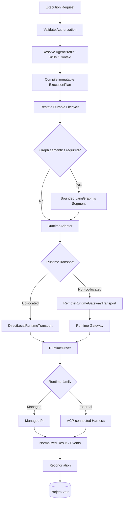
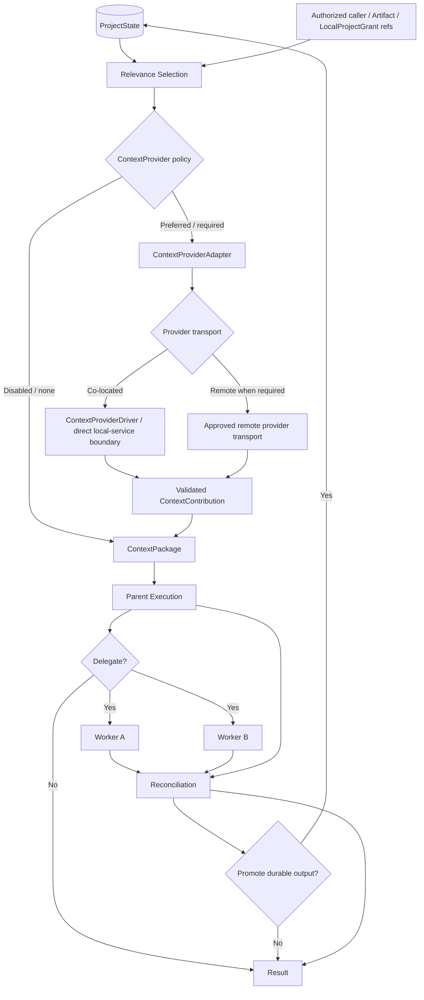
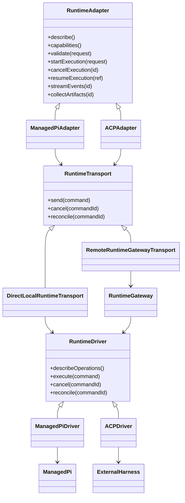
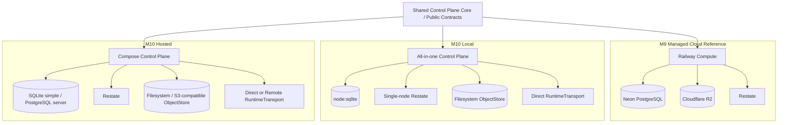
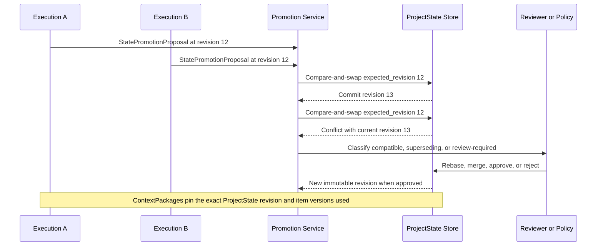

# Control Plane Diagram Sources

Status: Canonical repository companion source
Last reviewed: 2026-08-28

These Mermaid definitions are the version-controlled Control Plane companion to the canonical Google Drive diagram catalog. If the two sources diverge, update both in the same architecture reconciliation pass.

## Editing and rendering rules

1. Edit Mermaid source before replacing a rendered image.
2. Validate/render the diagram before updating an embedded figure.
3. Keep ownership boundaries consistent with the canonical PRDs/TDDs/ADRs.
4. Do not conflate Adea Remote Relay with Control Plane Runtime Gateway.
5. Co-located Local runtime/provider access must not traverse Runtime Gateway.
6. M9 managed cloud is Railway + Neon + R2 + Restate; M10 adds Local/Hosted adapters without changing core semantics.

## Control Plane TDD: Execution & Orchestration

## Control Plane TDD: Context & Delegation Lifecycle

## Control Plane TDD: Runtime Adapter Architecture

## Managed Cloud and Portability Profiles

## ProjectState Concurrency and Promotion

