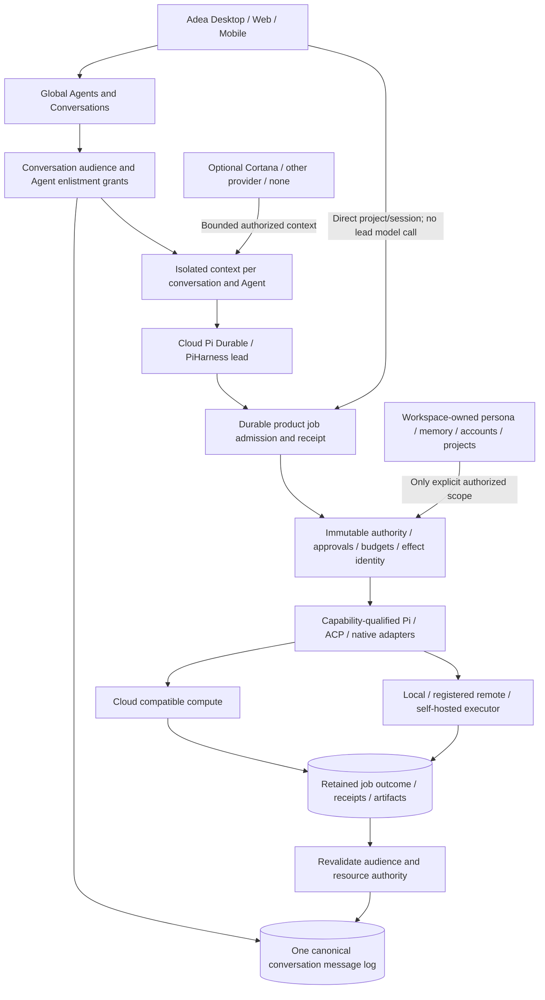
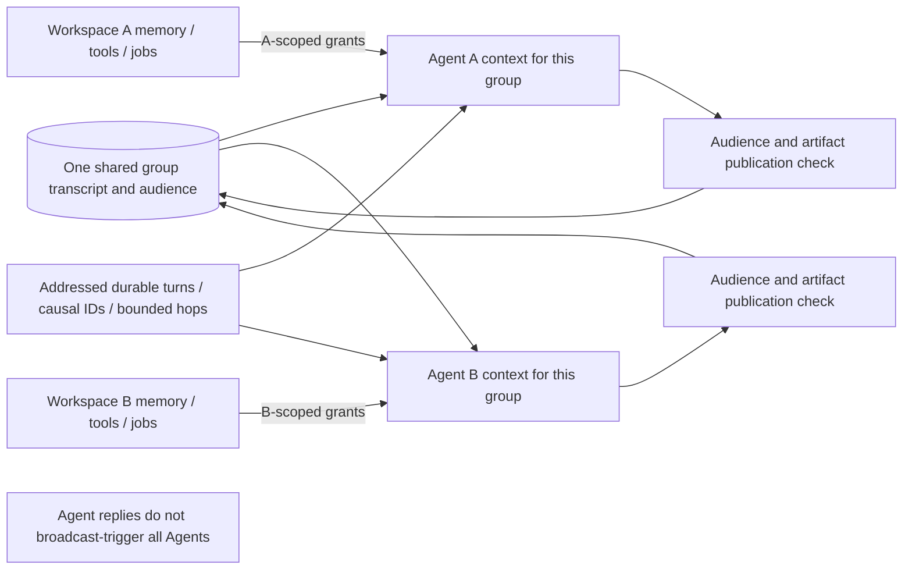
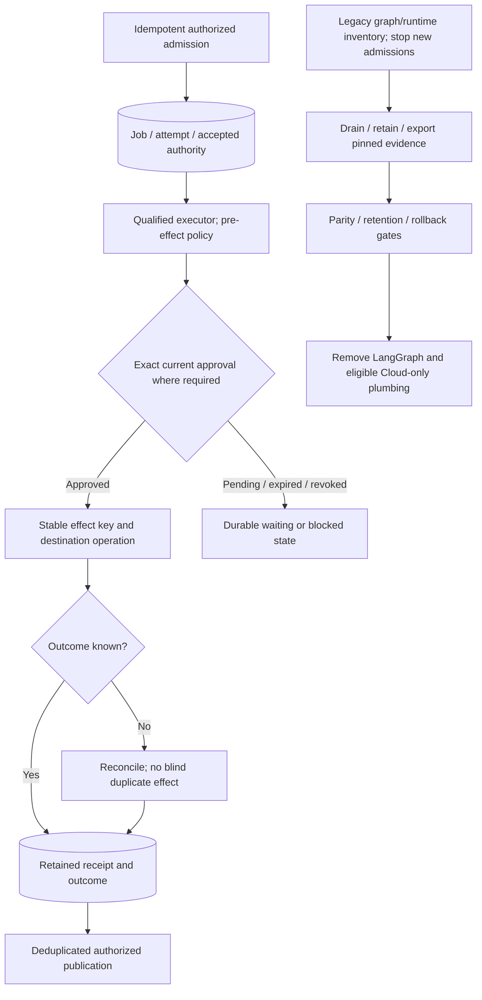
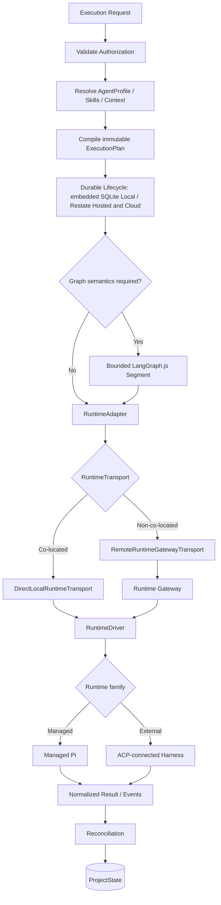
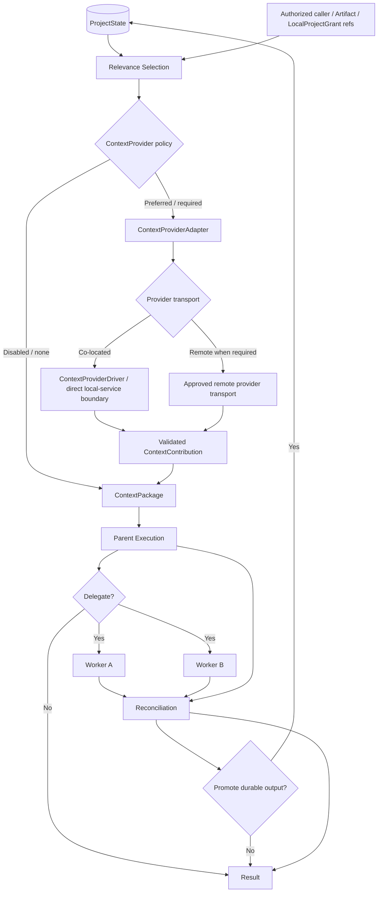
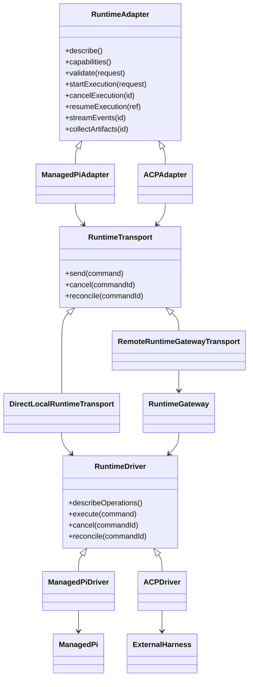
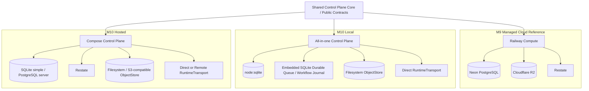
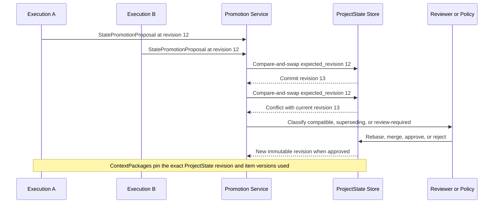

# Control Plane Diagram Sources

Status: Canonical repository companion source
Last reviewed: 2026-10-08 (planned Pi target source parity; full canonical audit remains open)

These Mermaid definitions are the version-controlled Control Plane companion to the canonical Google Drive diagram catalog. If the two sources diverge, update both in the same architecture reconciliation pass.

## Editing and rendering rules

1. Edit Mermaid source before replacing a rendered image.
2. Validate/render the diagram before updating an embedded figure.
3. Keep ownership boundaries consistent with the canonical PRDs/TDDs/ADRs.
4. Do not conflate Adea Remote Relay with Control Plane Runtime Gateway.
5. Co-located Local runtime/provider access must not traverse Runtime Gateway.
6. M9 managed cloud is Railway + Neon + R2 + Restate; M10 adds Local/Hosted adapters without changing core semantics.
7. Owner-approved #548: Local uses embedded SQLite durable execution without Restate; managed cloud and Hosted retain Restate behind the same workflow contracts.

## Pi Durable planned targets — 8 October 2026

Status: Selected target specification; implementation and profile qualification remain unverified.

The following definitions match P1–P3 in the [canonical Diagram Sources catalog](https://docs.google.com/document/d/163gbj0YZZA2dakPDTDJv9VlRzbwVC7KoZM5kix6YB7U), revision 83. They describe the intended migration, not deployed topology. Existing Local, Hosted and managed-cloud support remains until replacement behavior, retention and rollback gates qualify. No historical source or embedded image is replaced here.

### Target P1. Global conversations and scoped execution

Owning documents: Adea PRD, System Architecture Overview, Adea TDD, Control Plane TDD. Target captions must identify this as planned, not delivered. Sources P1–P3 supersede older target runtime topology for this migration; existing repository boundaries and optional Cortana remain.

Canonical revision 83, source lines 901–918.

```mermaid
flowchart TB
    UI["Adea Desktop / Web / Mobile"] --> NAV["Global Agents and Conversations"]
    NAV --> ACL["Conversation audience and Agent enlistment grants"]
    ACL --> LOG[("One canonical conversation message log")]
    ACL --> CTX["Isolated context per conversation and Agent"]
    CTX --> PI["Cloud Pi Durable / PiHarness lead"]
    PI --> JOB["Durable product job admission and receipt"]
    UI -->|"Direct project/session; no lead model call"| JOB
    JOB --> POLICY["Immutable authority / approvals / budgets / effect identity"]
    POLICY --> ADAPTER["Capability-qualified Pi / ACP / native adapters"]
    ADAPTER --> CLOUD["Cloud compatible compute"]
    ADAPTER --> DEVICE["Local / registered remote / self-hosted executor"]
    CLOUD --> OUT[("Retained job outcome / receipts / artifacts")]
    DEVICE --> OUT
    OUT --> PUB["Revalidate audience and resource authority"]
    PUB --> LOG
    WS["Workspace-owned persona / memory / accounts / projects"] -->|"Only explicit authorized scope"| POLICY
    MEM["Optional Cortana / other provider / none"] -->|"Bounded authorized context"| CTX
```

### Target P2. Cross-workspace group isolation

Owning documents: Adea TDD and Security & Trust Model. Conversation membership is not workspace membership. Shared output is an authorized disclosure; private tool results and memory are not pooled.

Canonical revision 83, source lines 923–935.

```mermaid
flowchart LR
    GROUP[("One shared group transcript and audience")]
    GROUP --> A["Agent A context for this group"]
    GROUP --> B["Agent B context for this group"]
    WA["Workspace A memory / tools / jobs"] -->|"A-scoped grants"| A
    WB["Workspace B memory / tools / jobs"] -->|"B-scoped grants"| B
    A --> PA["Audience and artifact publication check"]
    B --> PB["Audience and artifact publication check"]
    PA --> GROUP
    PB --> GROUP
    TURN["Addressed durable turns / causal IDs / bounded hops"] --> A
    TURN --> B
    NOTE["Agent replies do not broadcast-trigger all Agents"]
```

### Target P3. Job recovery and retirement gate

Owning documents: Control Plane TDD, Execution Consistency, Evaluation Plan. Durable result handling survives lead-turn abort. Legacy graph/runtime removal follows evidence, not the absence of imports.

Canonical revision 83, source lines 940–953.

```mermaid
flowchart TB
    ADMIT["Idempotent authorized admission"] --> RECEIPT[("Job / attempt / accepted authority")]
    RECEIPT --> EXEC["Qualified executor; pre-effect policy"]
    EXEC --> APPROVAL{"Exact current approval where required"}
    APPROVAL -->|"Approved"| EFFECT["Stable effect key and destination operation"]
    APPROVAL -->|"Pending / expired / revoked"| WAIT["Durable waiting or blocked state"]
    EFFECT --> CERTAIN{"Outcome known?"}
    CERTAIN -->|"Yes"| RESULT[("Retained receipt and outcome")]
    CERTAIN -->|"No"| RECON["Reconcile; no blind duplicate effect"]
    RECON --> RESULT
    RESULT --> OUTBOX["Deduplicated authorized publication"]
    LEGACY["Legacy graph/runtime inventory; stop new admissions"] --> DRAIN["Drain / retain / export pinned evidence"]
    DRAIN --> GATE["Parity / retention / rollback gates"]
    GATE --> REMOVE["Remove LangGraph and eligible Cloud-only plumbing"]
```

## Retained pre-migration references

The definitions below preserve the earlier execution and portability baseline. Restate/LangGraph as permanent future engines is superseded by the selected Pi target; active support is retained until qualified cutover. These definitions alone do not certify a current deployment or recovery result.

## Control Plane TDD: Execution & Orchestration

```mermaid
flowchart TB
    RQ[Execution Request] --> AUTH[Validate Authorization]
    AUTH --> RES[Resolve AgentProfile / Skills / Context]
    RES --> EP[Compile immutable ExecutionPlan]
    EP --> RS[Durable Lifecycle: embedded SQLite Local / Restate Hosted and Cloud]
    RS --> C{Graph semantics required?}
    C -->|No| RA[RuntimeAdapter]
    C -->|Yes| LG[Bounded LangGraph.js Segment]
    LG --> RA
    RA --> TR{RuntimeTransport}
    TR -->|Co-located| DL[DirectLocalRuntimeTransport]
    TR -->|Non-co-located| RG[RemoteRuntimeGatewayTransport]
    DL --> RD[RuntimeDriver]
    RG --> GW[Runtime Gateway]
    GW --> RD
    RD --> RT{Runtime family}
    RT -->|Managed| PI[Managed Pi]
    RT -->|External| ACP[ACP-connected Harness]
    PI --> OUT[Normalized Result / Events]
    ACP --> OUT
    OUT --> REC[Reconciliation]
    REC --> PS[(ProjectState)]
```

## Control Plane TDD: Context & Delegation Lifecycle

```mermaid
flowchart TB
    PS[(ProjectState)] --> SEL[Relevance Selection]
    EXT[Authorized caller / Artifact / LocalProjectGrant refs] --> SEL
    SEL --> PSEL{ContextProvider policy}
    PSEL -->|Disabled / none| CP[ContextPackage]
    PSEL -->|Preferred / required| CPA[ContextProviderAdapter]
    CPA --> CPD{Provider transport}
    CPD -->|Co-located| DIR[ContextProviderDriver / direct local-service boundary]
    CPD -->|Remote when required| REM[Approved remote provider transport]
    DIR --> CC[Validated ContextContribution]
    REM --> CC
    CC --> CP
    CP --> P[Parent Execution]
    P --> D{Delegate?}
    D -->|No| R[Result]
    D -->|Yes| W1[Worker A]
    D -->|Yes| W2[Worker B]
    W1 --> FAN[Reconciliation]
    W2 --> FAN
    P --> FAN
    FAN --> A{Promote durable output?}
    A -->|Yes| PS
    A -->|No| R
    FAN --> R
```

## Control Plane TDD: Runtime Adapter Architecture

```mermaid
classDiagram
    class RuntimeAdapter {
      +describe()
      +capabilities()
      +validate(request)
      +startExecution(request)
      +cancelExecution(id)
      +resumeExecution(ref)
      +streamEvents(id)
      +collectArtifacts(id)
    }
    class ManagedPiAdapter
    class ACPAdapter
    class RuntimeTransport {
      +send(command)
      +cancel(commandId)
      +reconcile(commandId)
    }
    class DirectLocalRuntimeTransport
    class RemoteRuntimeGatewayTransport
    class RuntimeGateway
    class RuntimeDriver {
      +describeOperations()
      +execute(command)
      +cancel(commandId)
      +reconcile(commandId)
    }
    class ManagedPiDriver
    class ACPDriver
    class ManagedPi
    class ExternalHarness

    RuntimeAdapter <|-- ManagedPiAdapter
    RuntimeAdapter <|-- ACPAdapter
    ManagedPiAdapter --> RuntimeTransport
    ACPAdapter --> RuntimeTransport
    RuntimeTransport <|-- DirectLocalRuntimeTransport
    RuntimeTransport <|-- RemoteRuntimeGatewayTransport
    DirectLocalRuntimeTransport --> RuntimeDriver
    RemoteRuntimeGatewayTransport --> RuntimeGateway
    RuntimeGateway --> RuntimeDriver
    RuntimeDriver <|-- ManagedPiDriver
    RuntimeDriver <|-- ACPDriver
    ManagedPiDriver --> ManagedPi
    ACPDriver --> ExternalHarness
```

## Managed Cloud and Portability Profiles

```mermaid
flowchart TB
    CORE[Shared Control Plane Core / Public Contracts]

    subgraph Cloud["M9 Managed Cloud Reference"]
      RAIL[Railway Compute]
      NEON[(Neon PostgreSQL)]
      R2[(Cloudflare R2)]
      RSC[Restate]
    end

    subgraph Local["M10 Local"]
      LCP[All-in-one Control Plane]
      SQL[(node:sqlite)]
      LRS[Embedded SQLite Durable Queue / Workflow Journal]
      FS[(Filesystem ObjectStore)]
      DRT[Direct RuntimeTransport]
    end

    subgraph Hosted["M10 Hosted"]
      HCP[Compose Control Plane]
      HP[(SQLite simple / PostgreSQL server)]
      HRS[Restate]
      HOS[(Filesystem / S3-compatible ObjectStore)]
      HRT[Direct or Remote RuntimeTransport]
    end

    CORE --> RAIL
    RAIL --> NEON
    RAIL --> R2
    RAIL --> RSC

    CORE --> LCP
    LCP --> SQL
    LCP --> LRS
    LCP --> FS
    LCP --> DRT

    CORE --> HCP
    HCP --> HP
    HCP --> HRS
    HCP --> HOS
    HCP --> HRT
```

## ProjectState Concurrency and Promotion

```mermaid
sequenceDiagram
    participant E1 as Execution A
    participant E2 as Execution B
    participant P as Promotion Service
    participant S as ProjectState Store
    participant R as Reviewer or Policy
    E1->>P: StatePromotionProposal at revision 12
    E2->>P: StatePromotionProposal at revision 12
    P->>S: Compare-and-swap expected_revision 12
    S-->>P: Commit revision 13
    P->>S: Compare-and-swap expected_revision 12
    S-->>P: Conflict with current revision 13
    P->>R: Classify compatible, superseding, or review-required
    R->>S: Rebase, merge, approve, or reject
    S-->>P: New immutable revision when approved
    Note over E1,S: ContextPackages pin the exact ProjectState revision and item versions used
```
